Submitted data error checks
================

- [0. Instructions for submitters](#0-instructions-for-submitters)
- [1. Submitter](#1-submitter)
- [2. Contributors](#2-contributors)
- [3. File and directory names](#3-file-and-directory-names)
- [4. Location](#4-location)
- [5.Keys and codes](#5keys-and-codes)
  - [Codes in Treatments sheet](#codes-in-treatments-sheet)
  - [Codes in Plots sheet](#codes-in-plots-sheet)
  - [Codes in Emission sheet](#codes-in-emission-sheet)
  - [Code merge check (matching project, experiment, field, plot,
    treatment)](#code-merge-check-matching-project-experiment-field-plot-treatment)
- [6. Publication info](#6-publication-info)
  - [Check for missing codes](#check-for-missing-codes)
  - [Complete citations given](#complete-citations-given)
- [7. Emission sheet](#7-emission-sheet)
  - [Duplicated intervals](#duplicated-intervals)
  - [Missing incorporation time](#missing-incorporation-time)
  - [Delay after application](#delay-after-application)
  - [Missing or double interval
    number](#missing-or-double-interval-number)
  - [Missing time between intervals](#missing-time-between-intervals)
  - [Measurement method and units](#measurement-method-and-units)
- [7. Value checks](#7-value-checks)
  - [Weather](#weather)
  - [Manure and application](#manure-and-application)
  - [Emission](#emission)
- [8. Missing values](#8-missing-values)
  - [All variables](#all-variables)
  - [Application method and measurement
    method](#application-method-and-measurement-method)
- [9. Plots](#9-plots)
  - [Calculated cumulative emission](#calculated-cumulative-emission)
  - [Final cumulative emission](#final-cumulative-emission)
  - [Relative versus absolute
    emission](#relative-versus-absolute-emission)
  - [Flux](#flux)
  - [Weather data](#weather-data)
  - [Manure and application](#manure-and-application-1)
- [10. Summary](#10-summary)
  - [Plot-level data](#plot-level-data)
  - [Interval-level emission data](#interval-level-emission-data)

# 0. Instructions for submitters

Submitters should use this file to check for problems with submitted
data. Send either a list of problems or confirmation that everything
looks OK to Sasha by email. Be sure to reference the dataset version and
file creation date/time when doing so. These are:

    ## Version:  3.0-dev

    ## [1] "Date/time: 2026-04-08 10:49:07.152658"

Each of these files contains a summary of the data from a single
submitted spreadsheet file. The html name is based on the name of the
submitted file. Use the details below to check:

- Institute abbreviation, submitter and contributor names
- The plot location(s), using the map zoom and pan features if needed
- For problems in the first sections; “OK” means there are no problems
  in a particular section, “warning” is something that should be checked
  (but might be OK), “error” is a problem that needs to be addressed
- For numeric values outside the expected range in the “Value checks”
  section
- Variables with missing values–are there any missing that you thought
  you included?
- Plots of flux, cumulative emission over time, and final cumulative
  emission for strange patterns, unexpectedly high or low values
- Plots of weather data for appropriate differences between plots and
  expected diurnal or other patterns
- Plots of manure and application data for correct values

Finally, the numeric summary at the end might provide details that can
help in pinpointing problems, but typically does not need to be checked.

# 1. Submitter

| inst.abbrev | submitter            | version | date |
|:------------|:---------------------|:--------|:-----|
| AU          | Larsen, Mikael Løvig | NA      | NA   |

# 2. Contributors

| contributor          | institute         | sub.period | file                                                    |
|:---------------------|:------------------|-----------:|:--------------------------------------------------------|
| Larsen, Mikael Løvig | Aarhus University |          4 | ../../data-submitted/04/AU/ALFAM2_8.3_N-Grass_Acid.xlsx |

# 3. File and directory names

    ## [1] "../../data-submitted/04/AU"

    ## [1] "../../data-submitted/04/AU/ALFAM2_8.3_N-Grass_Acid.xlsx"

# 4. Location

Location 1: lat=56.29339, long=9.33383 [View on
map](https://maps.google.com/?q=56.29339,9.33383)

# 5.Keys and codes

## Codes in Treatments sheet

    ## OK

    ## OK

## Codes in Plots sheet

    ## OK

    ## OK

## Codes in Emission sheet

    ## OK

    ## OK

## Code merge check (matching project, experiment, field, plot, treatment)

    ## OK

    ## OK

    ## OK

    ## OK

    ## OK

# 6. Publication info

## Check for missing codes

    ## OK

    ## OK

## Complete citations given

    ## OK

    ## OK

# 7. Emission sheet

## Duplicated intervals

    ## OK

## Missing incorporation time

    ## OK

## Delay after application

    ## bta (cum. time since application began) is not available.

## Missing or double interval number

    ## OK
    ## OK
    ## OK
    ## OK
    ## OK
    ## OK
    ## OK
    ## OK
    ## OK
    ## OK
    ## OK
    ## OK
    ## OK
    ## OK
    ## OK
    ## OK
    ## OK
    ## OK
    ## OK
    ## OK
    ## OK
    ## OK
    ## OK
    ## OK

## Missing time between intervals

    ## [1] "No start or end times provided, so cannot check for missing time."
    ## [1] "No start or end times provided, so cannot check for missing time."
    ## [1] "No start or end times provided, so cannot check for missing time."
    ## [1] "No start or end times provided, so cannot check for missing time."
    ## [1] "No start or end times provided, so cannot check for missing time."
    ## [1] "No start or end times provided, so cannot check for missing time."
    ## [1] "No start or end times provided, so cannot check for missing time."
    ## [1] "No start or end times provided, so cannot check for missing time."
    ## [1] "No start or end times provided, so cannot check for missing time."
    ## [1] "No start or end times provided, so cannot check for missing time."
    ## [1] "No start or end times provided, so cannot check for missing time."
    ## [1] "No start or end times provided, so cannot check for missing time."
    ## [1] "No start or end times provided, so cannot check for missing time."
    ## [1] "No start or end times provided, so cannot check for missing time."
    ## [1] "No start or end times provided, so cannot check for missing time."
    ## [1] "No start or end times provided, so cannot check for missing time."
    ## [1] "No start or end times provided, so cannot check for missing time."
    ## [1] "No start or end times provided, so cannot check for missing time."
    ## [1] "No start or end times provided, so cannot check for missing time."
    ## [1] "No start or end times provided, so cannot check for missing time."
    ## [1] "No start or end times provided, so cannot check for missing time."
    ## [1] "No start or end times provided, so cannot check for missing time."
    ## [1] "No start or end times provided, so cannot check for missing time."
    ## [1] "No start or end times provided, so cannot check for missing time."

## Measurement method and units

Measurement technique:

| Method          | Frequency |
|:----------------|----------:|
| Dynamic chamber |      1840 |

Measurement technique classification:

| Classification | Frequency |
|:---------------|----------:|
| chamber        |      1840 |

Emission units and conversion factors.

| Original unit | Conversion factor applied | Final unit |
|:--------------|--------------------------:|:-----------|
| kg N/ha-hr    |                         1 | kg N/ha-hr |

# 7. Value checks

Check to see if submitted values are within a reasonable range.

## Weather

    ## wind : No values to check.
    ## rain.rate : OK
    ## air.temp : OK
    ## soil.temp : OK
    ## soil.temp.surf : No values to check.
    ## air.temp.z : OK
    ## wind.z : No values to check.

## Manure and application

    ## man.stor : No values to check.
    ## man.dm : OK
    ## man.vs : Some values out of range
    ## [1] 75.21 81.97
    ## man.tkn : OK
    ## man.tan : OK
    ## man.tic : No values to check.
    ## man.ua : No values to check.
    ## man.vfa : Some values out of range
    ## [1]  9.20 20.37
    ## man.ph : OK
    ## app.rate : OK
    ## crop.z : No values to check.

## Emission

    ## j.NH3 : OK
    ## e.int : OK
    ## e.rel : OK

# 8. Missing values

Check for missing values.

## All variables

    ## Some values missing:
    ## Table below has number of missing observations by variable:
    ##         pub.id  meas.tech.det             oc      soil.type   soil.water.v 
    ##           1840           1840           1840           1840           1840 
    ##     soil.moist man.source.det        man.bed       man.trt2       man.trt3 
    ##           1840           1840           1840           1840           1840 
    ##       man.stor        man.tic         man.ua      app.start        app.end 
    ##           1840           1840           1840           1840           1840 
    ##    time.incorp       man.area       dist.inj       furrow.z       furrow.w 
    ##           1840           1840           1643           1643           1840 
    ##         crop.z      crop.area            lai     notes.plot app.start.orig 
    ##           1840           1840           1840           1739           1840 
    ##   app.end.orig        t.start          t.end          bg.dl         bg.val 
    ##           1840           1840           1840           1840           1840 
    ##        bg.unit        pH.surf soil.temp.surf            rad           wind 
    ##           1840           1840           1840           1840           1840 
    ##         wind.z            MOL          ustar             rl       air.pres 
    ##           1840           1840           1840           1840           1840 
    ##  air.pres.unit             rh       wind.loc        far.loc      notes.int 
    ##           1840           1840           1840           1840           1839 
    ##     j.NH3.orig        dt.calc        dt.diff            bta        wind.2m 
    ##             18           1840           1840           1840           1840 
    ##     soil.type2         exper2           rep2     date.start 
    ##           1840           1840           1840           1840

## Application method and measurement method

    ## OK

    ## OK

# 9. Plots

## Calculated cumulative emission

Cumulative emission. Missing values imputed (linear interpolation).
Numeric labels show position of data in data file: row in the “Plots”
sheet and first row in the “Emission” sheet. Labels in center of the
first plot have measurement method, manure source, and application
method. The same emission data are plotted a few different ways to
facilitate checking for problems, e.g., comparing plot to each other or
checking application dates. The same colors should be be used for
particular field plots throughout this section.

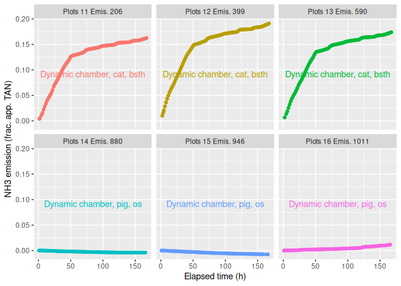<!-- -->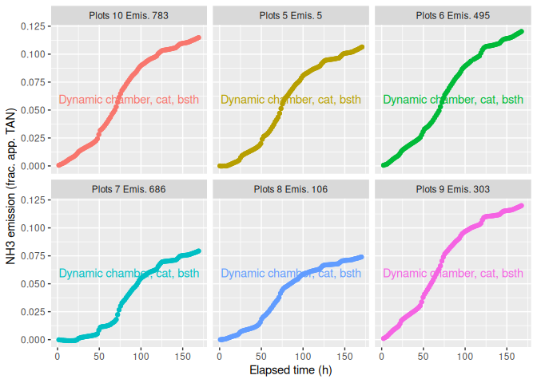<!-- -->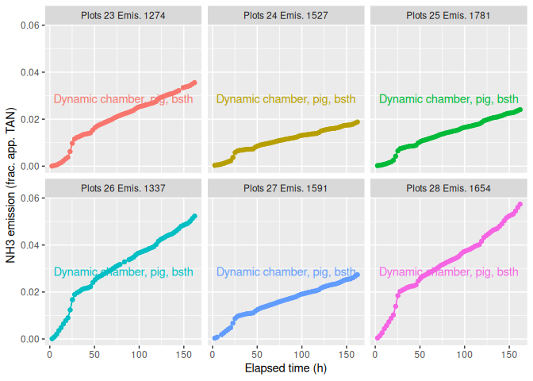<!-- -->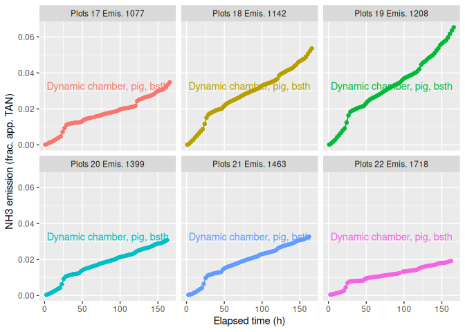<!-- -->

## Final cumulative emission

    ## `stat_bin()` using `bins = 30`. Pick better value `binwidth`.

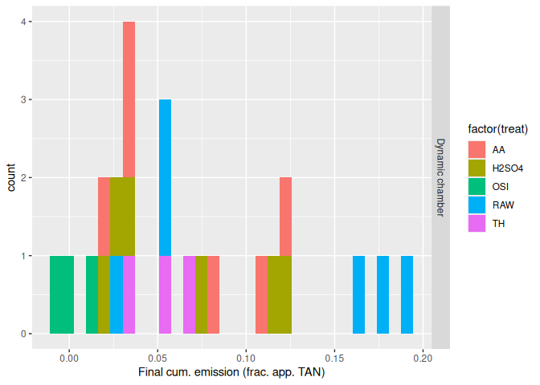<!-- -->

## Relative versus absolute emission

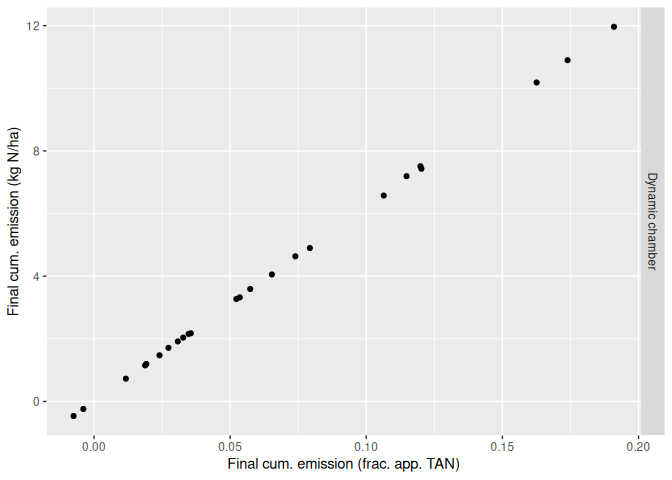<!-- -->

## Flux

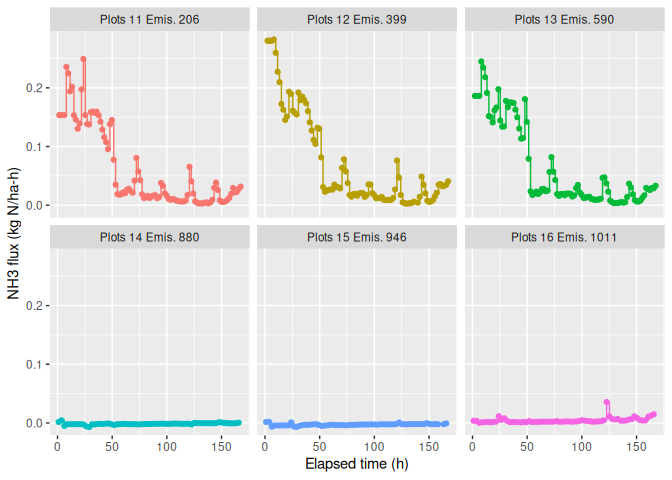<!-- -->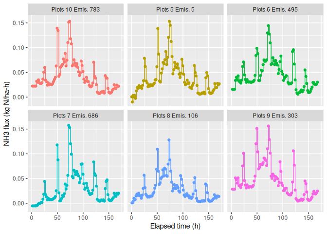<!-- -->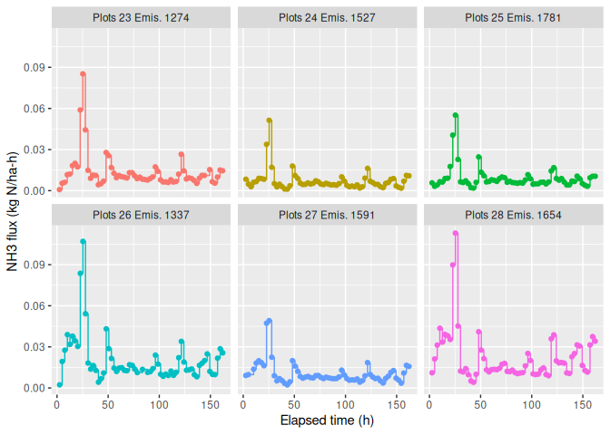<!-- -->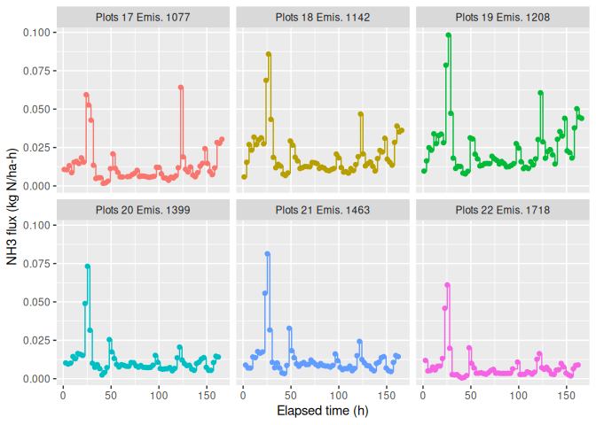<!-- -->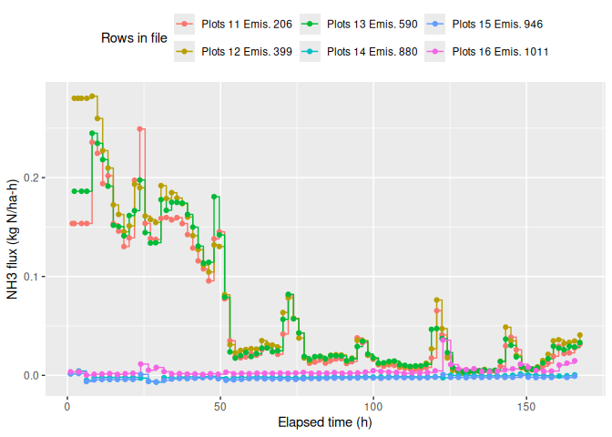<!-- -->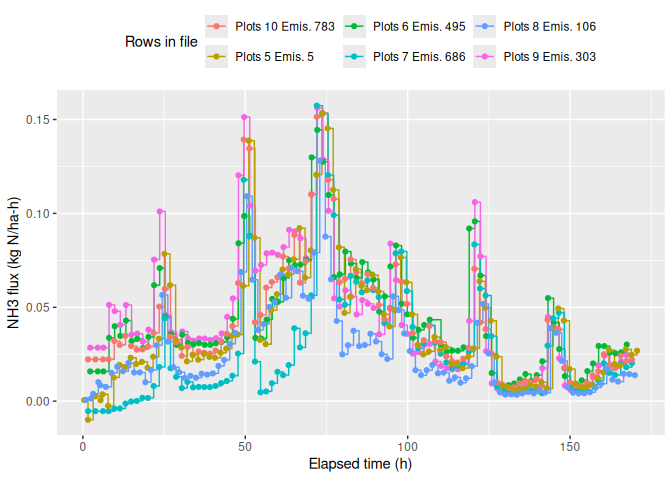<!-- -->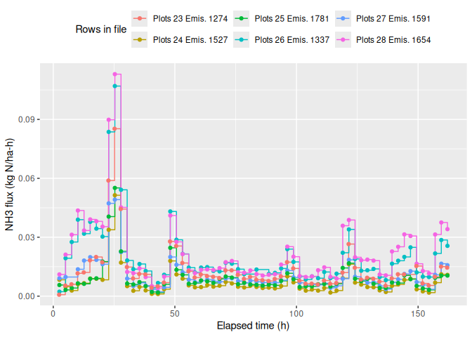<!-- -->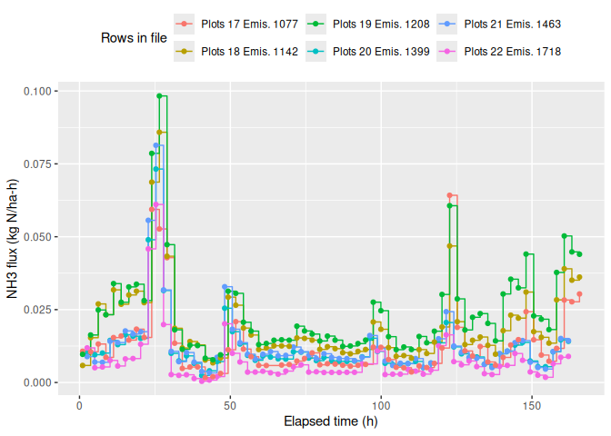<!-- -->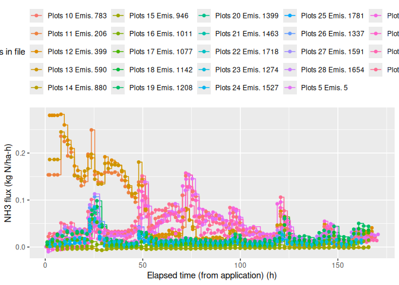<!-- --><!-- --><!-- --><!-- -->

## Weather data

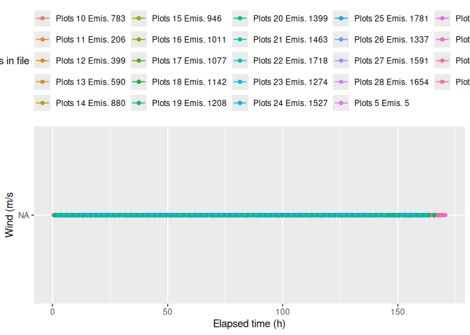<!-- -->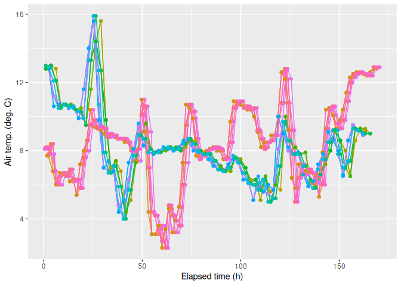<!-- -->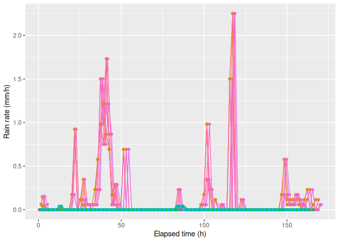<!-- -->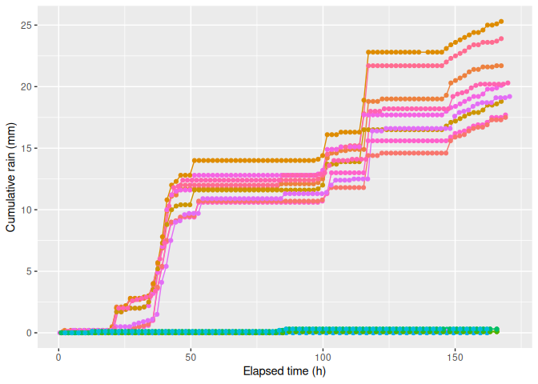<!-- -->

## Manure and application

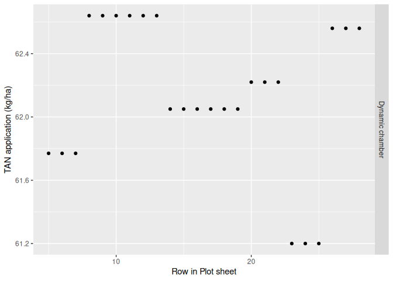<!-- -->

# 10. Summary

## Plot-level data

    ## 
    ##  24 rows and 210 columns
    ##  24 unique rows
    ##                       pub.id      proj      exper
    ## Class              character character  character
    ## Minimum                 <NA>   N-Grass CattleAcid
    ## Maximum                 <NA>   N-Grass    PigAcid
    ## Mean                    <NA>      <NA>       <NA>
    ## Unique (excld. NA)         0         1          2
    ## Missing values            24         0          0
    ## Sorted                  <NA>      TRUE       TRUE
    ##                                                  
    ##                                                                                                                                                                    cpmid
    ## Class                                                                                                                                                          character
    ## Minimum            D:1.I:AU.Pr:N-Grass.F:../../data-submitted/04/AU/ALFAM2_8.3_N-Grass_Acid.xlsx.E:CattleAcid.F:AU Foulum.P:11RAW.T:RAW.R:1.R2:.T:NA.M:Dynamic chamberNA
    ## Maximum            D:1.I:AU.Pr:N-Grass.F:../../data-submitted/04/AU/ALFAM2_8.3_N-Grass_Acid.xlsx.E:PigAcid.F:AU Foulum.P:8H2SO4.T:H2SO4.R:1.R2:.T:NA.M:Dynamic chamberNA
    ## Mean                                                                                                                                                                <NA>
    ## Unique (excld. NA)                                                                                                                                                    24
    ## Missing values                                                                                                                                                         0
    ## Sorted                                                                                                                                                              TRUE
    ##                                                                                                                                                                         
    ##                        field      plot       rep plot.area     lat    long
    ## Class              character character character   numeric numeric numeric
    ## Minimum            AU Foulum     10RAW         1      0.38    56.3    9.33
    ## Maximum            AU Foulum    8H2SO4         3      0.38    56.3    9.33
    ## Mean                    <NA>      <NA>      <NA>      0.38    56.3    9.33
    ## Unique (excld. NA)         1        20         3         1       1       1
    ## Missing values             0         0         0         0       0       0
    ## Sorted                  TRUE     FALSE     FALSE      TRUE    TRUE    TRUE
    ##                                                                           
    ##                      country      topo soil.samp.z    clay    silt    sand
    ## Class              character character   character integer integer integer
    ## Minimum                   DK      Flat         0-5       9      24      65
    ## Maximum                   DK      Flat         0-5       9      24      65
    ## Mean                    <NA>      <NA>        <NA>       9      24      65
    ## Unique (excld. NA)         1         1           1       1       1       1
    ## Missing values             0         0           0       0       0       0
    ## Sorted                  TRUE      TRUE        TRUE    TRUE    TRUE    TRUE
    ##                                                                           
    ##                         oc soil.type soil.water soil.water.v soil.moist soil.ph
    ## Class              logical   logical    numeric      logical    logical numeric
    ## Minimum               <NA>      <NA>       0.18         <NA>       <NA>     5.8
    ## Maximum               <NA>      <NA>       0.24         <NA>       <NA>     5.8
    ## Mean                  <NA>      <NA>      0.212         <NA>       <NA>     5.8
    ## Unique (excld. NA)       0         0          3            0          0       1
    ## Missing values          24        24          0           24         24       0
    ## Sorted                <NA>      <NA>      FALSE         <NA>       <NA>    TRUE
    ##                                                                                
    ##                    soil.dens  crop.res      till man.source man.source.det
    ## Class                numeric character character  character        logical
    ## Minimum                 1.45       Yes        No        cat           <NA>
    ## Maximum                  1.5       Yes        No        pig           <NA>
    ## Mean                    1.48      <NA>      <NA>       <NA>           <NA>
    ## Unique (excld. NA)         3         1         1          2              0
    ## Missing values             0         0         0          0             24
    ## Sorted                 FALSE      TRUE      TRUE       TRUE           <NA>
    ##                                                                           
    ##                    man.bed   man.con      man.trt1 man.trt2 man.trt3 man.stor
    ## Class              logical character     character  logical  logical  logical
    ## Minimum               <NA>    slurry Acidification     <NA>     <NA>     <NA>
    ## Maximum               <NA>    slurry          None     <NA>     <NA>     <NA>
    ## Mean                  <NA>      <NA>          <NA>     <NA>     <NA>     <NA>
    ## Unique (excld. NA)       0         1             2        0        0        0
    ## Missing values          24         0             0       24       24       24
    ## Sorted                <NA>      TRUE         FALSE     <NA>     <NA>     <NA>
    ##                                                                              
    ##                     man.dm  man.vs man.tkn man.tan man.tic  man.ua man.vfa
    ## Class              numeric numeric numeric numeric logical logical numeric
    ## Minimum                5.5    75.2    3.59    2.13    <NA>    <NA>     9.2
    ## Maximum               7.42      82    5.42    3.68    <NA>    <NA>    20.4
    ## Mean                  6.36    78.7    4.52    3.09    <NA>    <NA>    15.4
    ## Unique (excld. NA)       6       7       8       6       0       0       7
    ## Missing values           0       0       0       0      24      24       0
    ## Sorted               FALSE   FALSE   FALSE   FALSE    <NA>    <NA>   FALSE
    ##                                                                           
    ##                     man.ph       app.start         app.end app.method app.rate
    ## Class              numeric POSIXct, POSIXt POSIXct, POSIXt  character  integer
    ## Minimum               5.96            <NA>            <NA>       bsth       17
    ## Maximum               6.91            <NA>            <NA>         os       29
    ## Mean                  6.45            <NA>            <NA>       <NA>     21.5
    ## Unique (excld. NA)       7               0               0          2        2
    ## Missing values           0              24              24          0        0
    ## Sorted               FALSE            <NA>            <NA>      FALSE    FALSE
    ##                                                                               
    ##                    app.rate.unit    incorp time.incorp man.area dist.inj
    ## Class                  character character     numeric  logical  integer
    ## Minimum                     t/ha      none        <NA>     <NA>       25
    ## Maximum                     t/ha      none        <NA>     <NA>       25
    ## Mean                        <NA>      <NA>        <NA>     <NA>       25
    ## Unique (excld. NA)             1         1           0        0        1
    ## Missing values                 0         0          24       24       21
    ## Sorted                      TRUE      TRUE        <NA>     <NA>     TRUE
    ##                                                                         
    ##                    furrow.z furrow.w      crop  crop.z crop.area     lai
    ## Class               integer  logical character numeric   numeric logical
    ## Minimum                   5     <NA>     grass    <NA>      <NA>    <NA>
    ## Maximum                   5     <NA>     grass    <NA>      <NA>    <NA>
    ## Mean                      5     <NA>      <NA>    <NA>      <NA>    <NA>
    ## Unique (excld. NA)        1        0         1       0         0       0
    ## Missing values           21       24         0      24        24      24
    ## Sorted                 TRUE     <NA>      TRUE    <NA>      <NA>    <NA>
    ##                                                                         
    ##                    notes.plot row.in.file.plot institute sub.period
    ## Class               character          numeric character    numeric
    ## Minimum                     .                5        AU          4
    ## Maximum                     .               28        AU          4
    ## Mean                     <NA>             16.5      <NA>          4
    ## Unique (excld. NA)          1               24         1          1
    ## Missing values             23                0         0          0
    ## Sorted                   TRUE            FALSE      TRUE       TRUE
    ##                                                                    
    ##                                                                       file
    ## Class                                                            character
    ## Minimum            ../../data-submitted/04/AU/ALFAM2_8.3_N-Grass_Acid.xlsx
    ## Maximum            ../../data-submitted/04/AU/ALFAM2_8.3_N-Grass_Acid.xlsx
    ## Mean                                                                  <NA>
    ## Unique (excld. NA)                                                       1
    ## Missing values                                                           0
    ## Sorted                                                                TRUE
    ##                                                                           
    ##                        treat       meas.tech meas.tech.det app.start.orig
    ## Class              character       character       logical        logical
    ## Minimum                   AA Dynamic chamber          <NA>           <NA>
    ## Maximum                   TH Dynamic chamber          <NA>           <NA>
    ## Mean                    <NA>            <NA>          <NA>           <NA>
    ## Unique (excld. NA)         5               1             0              0
    ## Missing values             0               0            24             24
    ## Sorted                 FALSE            TRUE          <NA>           <NA>
    ##                                                                          
    ##                    app.end.orig
    ## Class                   logical
    ## Minimum                    <NA>
    ## Maximum                    <NA>
    ## Mean                       <NA>
    ## Unique (excld. NA)            0
    ## Missing values               24
    ## Sorted                     <NA>
    ##                                
    ##                                                                                                                                                 cpid
    ## Class                                                                                                                                      character
    ## Minimum            D:1.I:AU.Pr:N-Grass.F:../../data-submitted/04/AU/ALFAM2_8.3_N-Grass_Acid.xlsx.E:CattleAcid.F:AU Foulum.P:11RAW.T:RAW.R:1.R2:.T:NA
    ## Maximum            D:1.I:AU.Pr:N-Grass.F:../../data-submitted/04/AU/ALFAM2_8.3_N-Grass_Acid.xlsx.E:PigAcid.F:AU Foulum.P:8H2SO4.T:H2SO4.R:1.R2:.T:NA
    ## Mean                                                                                                                                            <NA>
    ## Unique (excld. NA)                                                                                                                                24
    ## Missing values                                                                                                                                     0
    ## Sorted                                                                                                                                          TRUE
    ##                                                                                                                                                     
    ##                                                ceid flag.plot
    ## Class                                     character character
    ## Minimum            D:1.I:AU.Pr:N-Grass.E:CattleAcid          
    ## Maximum               D:1.I:AU.Pr:N-Grass.E:PigAcid          
    ## Mean                                           <NA>      <NA>
    ## Unique (excld. NA)                                2         1
    ## Missing values                                    0         0
    ## Sorted                                         TRUE      TRUE
    ##                                                              
    ##                               submitter tan.app  e.cum.1 e.cum.4 e.cum.6
    ## Class                         character numeric  numeric numeric numeric
    ## Minimum            Larsen, Mikael Løvig    61.2 -0.00571 -0.0213 -0.0319
    ## Maximum            Larsen, Mikael Løvig    62.6 0.000802    1.12    1.68
    ## Mean                               <NA>    62.1 -0.00245   0.134   0.204
    ## Unique (excld. NA)                    1       6        2      24      24
    ## Missing values                        0       0       22       0       0
    ## Sorted                             TRUE   FALSE     TRUE   FALSE   FALSE
    ##                                                                         
    ##                    e.cum.12 e.cum.24 e.cum.48 e.cum.72 e.cum.96 e.cum.168
    ## Class               numeric  numeric  numeric  numeric  numeric   numeric
    ## Minimum             -0.0565  -0.0718   -0.165   -0.256   -0.329      4.61
    ## Maximum                3.21     5.28     8.98     10.1     10.7      7.17
    ## Mean                  0.461     1.01     1.83     2.53     3.12      5.79
    ## Unique (excld. NA)       24       24       24       24       24         4
    ## Missing values            0        0        0        0        0        20
    ## Sorted                FALSE    FALSE    FALSE    FALSE    FALSE     FALSE
    ##                                                                          
    ##                    e.cum.final   e.rel.1   e.rel.4   e.rel.6  e.rel.12 e.rel.24
    ## Class                  numeric   numeric   numeric   numeric   numeric  numeric
    ## Minimum                 -0.466 -9.25e-05 -0.000344 -0.000517 -0.000914 -0.00116
    ## Maximum                     12  1.28e-05    0.0179    0.0268    0.0512   0.0843
    ## Mean                      4.14 -3.98e-05   0.00215   0.00327   0.00738   0.0161
    ## Unique (excld. NA)          24         2        24        24        24       24
    ## Missing values               0        22         0         0         0        0
    ## Sorted                   FALSE      TRUE     FALSE     FALSE     FALSE    FALSE
    ##                                                                                
    ##                    e.rel.48 e.rel.72 e.rel.96 e.rel.168 e.rel.final  rain.1
    ## Class               numeric  numeric  numeric   numeric     numeric numeric
    ## Minimum            -0.00266 -0.00413 -0.00531    0.0735    -0.00751       0
    ## Maximum               0.143    0.161     0.17     0.114       0.191       0
    ## Mean                 0.0293   0.0405     0.05    0.0931      0.0664       0
    ## Unique (excld. NA)       24       24       24         4          24       1
    ## Missing values            0        0        0        20           0      22
    ## Sorted                FALSE    FALSE    FALSE     FALSE       FALSE    TRUE
    ##                                                                            
    ##                     rain.4  rain.6 rain.12 rain.24 rain.48 rain.72 rain.96
    ## Class              numeric numeric numeric numeric numeric numeric numeric
    ## Minimum                  0       0       0       0       0       0       0
    ## Maximum                0.2     0.2     0.2     2.1    12.8      14      14
    ## Mean                0.0421  0.0458  0.0576   0.536    4.16    4.47    4.61
    ## Unique (excld. NA)       4       3       8       9      11      11      12
    ## Missing values           0       0       0       0       0       0       0
    ## Sorted               FALSE   FALSE   FALSE   FALSE   FALSE   FALSE   FALSE
    ##                                                                           
    ##                    rain.168 rain.final air.temp.1 air.temp.4 air.temp.6
    ## Class               numeric    numeric    numeric    numeric    numeric
    ## Minimum                17.4          0        8.1        7.7       7.24
    ## Maximum                20.2       25.3        8.2       12.9       12.9
    ## Mean                   18.6       7.78       8.15         11       10.7
    ## Unique (excld. NA)        4         13          2         18         24
    ## Missing values           20          0         22          0          0
    ## Sorted                FALSE      FALSE       TRUE      FALSE      FALSE
    ##                                                                        
    ##                    air.temp.12 air.temp.24 air.temp.48 air.temp.72 air.temp.96
    ## Class                  numeric     numeric     numeric     numeric     numeric
    ## Minimum                    6.8        6.94        7.92        6.95        7.36
    ## Maximum                   11.9        11.3        9.94         9.4        8.95
    ## Mean                      9.83        9.67        9.04         8.4        8.29
    ## Unique (excld. NA)          24          24          24          24          24
    ## Missing values               0           0           0           0           0
    ## Sorted                   FALSE       FALSE       FALSE       FALSE       FALSE
    ##                                                                               
    ##                    air.temp.168 air.temp.mn soil.temp.1 soil.temp.4 soil.temp.6
    ## Class                   numeric     numeric     numeric     numeric     numeric
    ## Minimum                    8.14        8.14         9.3        9.38        9.41
    ## Maximum                    8.45        8.47         9.4          11        11.1
    ## Mean                       8.28        8.29        9.35        10.4        10.4
    ## Unique (excld. NA)           24          24           2          13          24
    ## Missing values                0           0          22           0           0
    ## Sorted                    FALSE       FALSE        TRUE       FALSE       FALSE
    ##                                                                                
    ##                    soil.temp.12 soil.temp.24 soil.temp.48 soil.temp.72
    ## Class                   numeric      numeric      numeric      numeric
    ## Minimum                    9.54          9.5         9.64         9.56
    ## Maximum                    11.1           11         10.8         10.6
    ## Mean                       10.5         10.4         10.4         10.2
    ## Unique (excld. NA)           24           24           24           24
    ## Missing values                0            0            0            0
    ## Sorted                    FALSE        FALSE        FALSE        FALSE
    ##                                                                       
    ##                    soil.temp.96 soil.temp.168 soil.temp.mn soil.temp.surf.1
    ## Class                   numeric       numeric      numeric          numeric
    ## Minimum                    9.46          9.55         9.57             <NA>
    ## Maximum                    10.4          10.1         10.1             <NA>
    ## Mean                       10.1          9.89          9.9             <NA>
    ## Unique (excld. NA)           24            24           24                0
    ## Missing values                0             0            0               24
    ## Sorted                    FALSE         FALSE        FALSE             <NA>
    ##                                                                            
    ##                    soil.temp.surf.4 soil.temp.surf.6 soil.temp.surf.12
    ## Class                       numeric          numeric           numeric
    ## Minimum                        <NA>             <NA>              <NA>
    ## Maximum                        <NA>             <NA>              <NA>
    ## Mean                           <NA>             <NA>              <NA>
    ## Unique (excld. NA)                0                0                 0
    ## Missing values                   24               24                24
    ## Sorted                         <NA>             <NA>              <NA>
    ##                                                                       
    ##                    soil.temp.surf.24 soil.temp.surf.48 soil.temp.surf.72
    ## Class                        numeric           numeric           numeric
    ## Minimum                         <NA>              <NA>              <NA>
    ## Maximum                         <NA>              <NA>              <NA>
    ## Mean                            <NA>              <NA>              <NA>
    ## Unique (excld. NA)                 0                 0                 0
    ## Missing values                    24                24                24
    ## Sorted                          <NA>              <NA>              <NA>
    ##                                                                         
    ##                    soil.temp.surf.96 soil.temp.surf.168 soil.temp.surf.mn
    ## Class                        numeric            numeric           numeric
    ## Minimum                         <NA>               <NA>              <NA>
    ## Maximum                         <NA>               <NA>              <NA>
    ## Mean                            <NA>               <NA>              <NA>
    ## Unique (excld. NA)                 0                  0                 0
    ## Missing values                    24                 24                24
    ## Sorted                          <NA>               <NA>              <NA>
    ##                                                                          
    ##                     wind.1  wind.4  wind.6 wind.12 wind.24 wind.48 wind.72
    ## Class              numeric numeric numeric numeric numeric numeric numeric
    ## Minimum               <NA>    <NA>    <NA>    <NA>    <NA>    <NA>    <NA>
    ## Maximum               <NA>    <NA>    <NA>    <NA>    <NA>    <NA>    <NA>
    ## Mean                  <NA>    <NA>    <NA>    <NA>    <NA>    <NA>    <NA>
    ## Unique (excld. NA)       0       0       0       0       0       0       0
    ## Missing values          24      24      24      24      24      24      24
    ## Sorted                <NA>    <NA>    <NA>    <NA>    <NA>    <NA>    <NA>
    ##                                                                           
    ##                    wind.96 wind.168 wind.mn wind.2m.1 wind.2m.4 wind.2m.6
    ## Class              numeric  numeric numeric   numeric   numeric   numeric
    ## Minimum               <NA>     <NA>    <NA>      <NA>      <NA>      <NA>
    ## Maximum               <NA>     <NA>    <NA>      <NA>      <NA>      <NA>
    ## Mean                  <NA>     <NA>    <NA>      <NA>      <NA>      <NA>
    ## Unique (excld. NA)       0        0       0         0         0         0
    ## Missing values          24       24      24        24        24        24
    ## Sorted                <NA>     <NA>    <NA>      <NA>      <NA>      <NA>
    ##                                                                          
    ##                    wind.2m.12 wind.2m.24 wind.2m.48 wind.2m.72 wind.2m.96
    ## Class                 numeric    numeric    numeric    numeric    numeric
    ## Minimum                  <NA>       <NA>       <NA>       <NA>       <NA>
    ## Maximum                  <NA>       <NA>       <NA>       <NA>       <NA>
    ## Mean                     <NA>       <NA>       <NA>       <NA>       <NA>
    ## Unique (excld. NA)          0          0          0          0          0
    ## Missing values             24         24         24         24         24
    ## Sorted                   <NA>       <NA>       <NA>       <NA>       <NA>
    ##                                                                          
    ##                    wind.2m.168 wind.2m.mn   rad.1   rad.4   rad.6  rad.12
    ## Class                  numeric    numeric numeric numeric numeric numeric
    ## Minimum                   <NA>       <NA>    <NA>    <NA>    <NA>    <NA>
    ## Maximum                   <NA>       <NA>    <NA>    <NA>    <NA>    <NA>
    ## Mean                      <NA>       <NA>    <NA>    <NA>    <NA>    <NA>
    ## Unique (excld. NA)           0          0       0       0       0       0
    ## Missing values              24         24      24      24      24      24
    ## Sorted                    <NA>       <NA>    <NA>    <NA>    <NA>    <NA>
    ##                                                                          
    ##                     rad.24  rad.48  rad.72  rad.96 rad.168  rad.mn rain.rate.1
    ## Class              numeric numeric numeric numeric numeric numeric     numeric
    ## Minimum               <NA>    <NA>    <NA>    <NA>    <NA>    <NA>           0
    ## Maximum               <NA>    <NA>    <NA>    <NA>    <NA>    <NA>           0
    ## Mean                  <NA>    <NA>    <NA>    <NA>    <NA>    <NA>           0
    ## Unique (excld. NA)       0       0       0       0       0       0           1
    ## Missing values          24      24      24      24      24      24          22
    ## Sorted                <NA>    <NA>    <NA>    <NA>    <NA>    <NA>        TRUE
    ##                                                                               
    ##                    rain.rate.4 rain.rate.6 rain.rate.12 rain.rate.24
    ## Class                  numeric     numeric      numeric      numeric
    ## Minimum                      0           0            0            0
    ## Maximum                 0.0887      0.0435       0.0178       0.0888
    ## Mean                     0.015     0.00992      0.00404       0.0226
    ## Unique (excld. NA)          10          10           10           15
    ## Missing values               0           0            0            0
    ## Sorted                   FALSE       FALSE        FALSE        FALSE
    ##                                                                     
    ##                    rain.rate.48 rain.rate.72 rain.rate.96 rain.rate.168
    ## Class                   numeric      numeric      numeric       numeric
    ## Minimum                       0            0            0             0
    ## Maximum                   0.267        0.199        0.148         0.151
    ## Mean                     0.0872       0.0632       0.0487        0.0464
    ## Unique (excld. NA)           15           15           23            23
    ## Missing values                0            0            0             0
    ## Sorted                    FALSE        FALSE        FALSE         FALSE
    ##                                                                        
    ##                    rain.rate.mn    rh.1    rh.4    rh.6   rh.12   rh.24   rh.48
    ## Class                   numeric numeric numeric numeric numeric numeric numeric
    ## Minimum                       0    <NA>    <NA>    <NA>    <NA>    <NA>    <NA>
    ## Maximum                   0.151    <NA>    <NA>    <NA>    <NA>    <NA>    <NA>
    ## Mean                     0.0463    <NA>    <NA>    <NA>    <NA>    <NA>    <NA>
    ## Unique (excld. NA)           23       0       0       0       0       0       0
    ## Missing values                0      24      24      24      24      24      24
    ## Sorted                    FALSE    <NA>    <NA>    <NA>    <NA>    <NA>    <NA>
    ##                                                                                
    ##                      rh.72   rh.96  rh.168   rh.mn first.row.in.file.int
    ## Class              numeric numeric numeric numeric               numeric
    ## Minimum               <NA>    <NA>    <NA>    <NA>                     5
    ## Maximum               <NA>    <NA>    <NA>    <NA>                  1780
    ## Mean                  <NA>    <NA>    <NA>    <NA>                   983
    ## Unique (excld. NA)       0       0       0       0                    24
    ## Missing values          24      24      24      24                     0
    ## Sorted                <NA>    <NA>    <NA>    <NA>                 FALSE
    ##                                                                         
    ##                    last.row.in.file.int  n.ints     dt1    j.rel1   j.NH31
    ## Class                           numeric integer numeric   numeric  numeric
    ## Minimum                             105      62     0.4 -8.61e-05 -0.00532
    ## Maximum                            1840     101    2.53   0.00447     0.28
    ## Mean                               1060    76.7    1.83  0.000522   0.0327
    ## Unique (excld. NA)                   24      10      24        24       24
    ## Missing values                        0       0       0         0        0
    ## Sorted                            FALSE   FALSE   FALSE     FALSE    FALSE
    ##                                                                           
    ##                     dt.min  dt.max  ct.min  ct.max       t.start.p
    ## Class              numeric numeric numeric numeric POSIXct, POSIXt
    ## Minimum                0.4    1.73     0.4     162            <NA>
    ## Maximum               2.53    5.07    2.53     171            <NA>
    ## Mean                  1.67    3.16    1.83     165            <NA>
    ## Unique (excld. NA)      24      24      24      24               0
    ## Missing values           0       0       0       0              24
    ## Sorted               FALSE   FALSE   FALSE   FALSE            <NA>
    ##                                                                   
    ##                            t.end.p air.temp.z soil.temp.z  wind.z wind.loc
    ## Class              POSIXct, POSIXt    numeric     numeric logical  logical
    ## Minimum                       <NA>        0.2         0.1    <NA>     <NA>
    ## Maximum                       <NA>        0.2         0.1    <NA>     <NA>
    ## Mean                          <NA>        0.2         0.1    <NA>     <NA>
    ## Unique (excld. NA)               0          1           1       0        0
    ## Missing values                  24          0           0      24       24
    ## Sorted                        <NA>       TRUE        TRUE    <NA>     <NA>
    ##                                                                           
    ##                    far.loc  pub.info soil.type2  exper2    rep2     acid
    ## Class              logical character    logical logical logical  logical
    ## Minimum               <NA>         .       <NA>    <NA>    <NA>    FALSE
    ## Maximum               <NA>         .       <NA>    <NA>    <NA>     TRUE
    ## Mean                  <NA>      <NA>       <NA>    <NA>    <NA> 0.5 TRUE
    ## Unique (excld. NA)       0         1          0       0       0        2
    ## Missing values          24         0         24      24      24        0
    ## Sorted                <NA>      TRUE       <NA>    <NA>    <NA>    FALSE
    ##                                                                         
    ##                     meas.tech.orig meas.tech2 crop.orig
    ## Class                    character  character character
    ## Minimum            Dynamic chamber    chamber     Grass
    ## Maximum            Dynamic chamber    chamber     Grass
    ## Mean                          <NA>       <NA>      <NA>
    ## Unique (excld. NA)               1          1         1
    ## Missing values                   0          0         0
    ## Sorted                        TRUE       TRUE      TRUE
    ##                                                        
    ##                                 app.method.orig incorp.orig man.source.orig
    ## Class                                 character   character       character
    ## Minimum            Band spread or trailing hose        None          Cattle
    ## Maximum                     Open slot injection        None             Pig
    ## Mean                                       <NA>        <NA>            <NA>
    ## Unique (excld. NA)                            2           1               2
    ## Missing values                                0           0               0
    ## Sorted                                    FALSE        TRUE            TRUE
    ##                                                                            
    ##                    date.start
    ## Class                    Date
    ## Minimum                  <NA>
    ## Maximum                  <NA>
    ## Mean                     <NA>
    ## Unique (excld. NA)          0
    ## Missing values             24
    ## Sorted                   <NA>
    ## 

## Interval-level emission data

    ## 
    ##  1840 rows and 139 columns
    ##  1840 unique rows
    ##                                                                                                                                                                    cpmid
    ## Class                                                                                                                                                          character
    ## Minimum            D:1.I:AU.Pr:N-Grass.F:../../data-submitted/04/AU/ALFAM2_8.3_N-Grass_Acid.xlsx.E:CattleAcid.F:AU Foulum.P:11RAW.T:RAW.R:1.R2:.T:NA.M:Dynamic chamberNA
    ## Maximum            D:1.I:AU.Pr:N-Grass.F:../../data-submitted/04/AU/ALFAM2_8.3_N-Grass_Acid.xlsx.E:PigAcid.F:AU Foulum.P:8H2SO4.T:H2SO4.R:1.R2:.T:NA.M:Dynamic chamberNA
    ## Mean                                                                                                                                                                <NA>
    ## Unique (excld. NA)                                                                                                                                                    24
    ## Missing values                                                                                                                                                         0
    ## Sorted                                                                                                                                                              TRUE
    ##                                                                                                                                                                         
    ##                       pub.id      proj      exper     field      plot       rep
    ## Class              character character  character character character character
    ## Minimum                 <NA>   N-Grass CattleAcid AU Foulum     10RAW         1
    ## Maximum                 <NA>   N-Grass    PigAcid AU Foulum    8H2SO4         3
    ## Mean                    <NA>      <NA>       <NA>      <NA>      <NA>      <NA>
    ## Unique (excld. NA)         0         1          2         1        20         3
    ## Missing values          1840         0          0         0         0         0
    ## Sorted                  <NA>      TRUE       TRUE      TRUE     FALSE     FALSE
    ##                                                                                
    ##                        treat       meas.tech meas.tech.det plot.area     lat
    ## Class              character       character       logical   numeric numeric
    ## Minimum                   AA Dynamic chamber          <NA>      0.38    56.3
    ## Maximum                   TH Dynamic chamber          <NA>      0.38    56.3
    ## Mean                    <NA>            <NA>          <NA>      0.38    56.3
    ## Unique (excld. NA)         5               1             0         1       1
    ## Missing values             0               0          1840         0       0
    ## Sorted                 FALSE            TRUE          <NA>      TRUE    TRUE
    ##                                                                             
    ##                       long   country      topo soil.samp.z    clay    silt
    ## Class              numeric character character   character integer integer
    ## Minimum               9.33        DK      Flat         0-5       9      24
    ## Maximum               9.33        DK      Flat         0-5       9      24
    ## Mean                  9.33      <NA>      <NA>        <NA>       9      24
    ## Unique (excld. NA)       1         1         1           1       1       1
    ## Missing values           0         0         0           0       0       0
    ## Sorted                TRUE      TRUE      TRUE        TRUE    TRUE    TRUE
    ##                                                                           
    ##                       sand      oc soil.type soil.water soil.water.v soil.moist
    ## Class              integer logical   logical    numeric      logical    logical
    ## Minimum                 65    <NA>      <NA>       0.18         <NA>       <NA>
    ## Maximum                 65    <NA>      <NA>       0.24         <NA>       <NA>
    ## Mean                    65    <NA>      <NA>      0.207         <NA>       <NA>
    ## Unique (excld. NA)       1       0         0          3            0          0
    ## Missing values           0    1840      1840          0         1840       1840
    ## Sorted                TRUE    <NA>      <NA>      FALSE         <NA>       <NA>
    ##                                                                                
    ##                    soil.ph soil.dens  crop.res      till man.source
    ## Class              numeric   numeric character character  character
    ## Minimum                5.8      1.45       Yes        No        cat
    ## Maximum                5.8       1.5       Yes        No        pig
    ## Mean                   5.8      1.48      <NA>      <NA>       <NA>
    ## Unique (excld. NA)       1         3         1         1          2
    ## Missing values           0         0         0         0          0
    ## Sorted                TRUE     FALSE      TRUE      TRUE       TRUE
    ##                                                                    
    ##                    man.source.det man.bed   man.con      man.trt1 man.trt2
    ## Class                     logical logical character     character  logical
    ## Minimum                      <NA>    <NA>    slurry Acidification     <NA>
    ## Maximum                      <NA>    <NA>    slurry          None     <NA>
    ## Mean                         <NA>    <NA>      <NA>          <NA>     <NA>
    ## Unique (excld. NA)              0       0         1             2        0
    ## Missing values               1840    1840         0             0     1840
    ## Sorted                       <NA>    <NA>      TRUE         FALSE     <NA>
    ##                                                                           
    ##                    man.trt3 man.stor  man.dm  man.vs man.tkn man.tan man.tic
    ## Class               logical  logical numeric numeric numeric numeric logical
    ## Minimum                <NA>     <NA>     5.5    75.2    3.59    2.13    <NA>
    ## Maximum                <NA>     <NA>    7.42      82    5.42    3.68    <NA>
    ## Mean                   <NA>     <NA>    6.51    79.1     4.4    2.94    <NA>
    ## Unique (excld. NA)        0        0       6       7       8       6       0
    ## Missing values         1840     1840       0       0       0       0    1840
    ## Sorted                 <NA>     <NA>   FALSE   FALSE   FALSE   FALSE    <NA>
    ##                                                                             
    ##                     man.ua man.vfa  man.ph       app.start         app.end
    ## Class              logical numeric numeric POSIXct, POSIXt POSIXct, POSIXt
    ## Minimum               <NA>     9.2    5.96            <NA>            <NA>
    ## Maximum               <NA>    20.4    6.91            <NA>            <NA>
    ## Mean                  <NA>    14.6    6.45            <NA>            <NA>
    ## Unique (excld. NA)       0       7       7               0               0
    ## Missing values        1840       0       0            1840            1840
    ## Sorted                <NA>   FALSE   FALSE            <NA>            <NA>
    ##                                                                           
    ##                    app.method app.rate app.rate.unit    incorp time.incorp
    ## Class               character  integer     character character     numeric
    ## Minimum                  bsth       17          t/ha      none        <NA>
    ## Maximum                    os       29          t/ha      none        <NA>
    ## Mean                     <NA>     22.7          <NA>      <NA>        <NA>
    ## Unique (excld. NA)          2        2             1         1           0
    ## Missing values              0        0             0         0        1840
    ## Sorted                  FALSE    FALSE          TRUE      TRUE        <NA>
    ##                                                                           
    ##                    man.area dist.inj furrow.z furrow.w      crop  crop.z
    ## Class               logical  integer  integer  logical character numeric
    ## Minimum                <NA>       25        5     <NA>     grass    <NA>
    ## Maximum                <NA>       25        5     <NA>     grass    <NA>
    ## Mean                   <NA>       25        5     <NA>      <NA>    <NA>
    ## Unique (excld. NA)        0        1        1        0         1       0
    ## Missing values         1840     1643     1643     1840         0    1840
    ## Sorted                 <NA>     TRUE     TRUE     <NA>      TRUE    <NA>
    ##                                                                         
    ##                    crop.area     lai notes.plot row.in.file.plot institute
    ## Class                numeric logical  character          numeric character
    ## Minimum                 <NA>    <NA>          .                5        AU
    ## Maximum                 <NA>    <NA>          .               28        AU
    ## Mean                    <NA>    <NA>       <NA>             15.2      <NA>
    ## Unique (excld. NA)         0       0          1               24         1
    ## Missing values          1840    1840       1739                0         0
    ## Sorted                  <NA>    <NA>       TRUE            FALSE      TRUE
    ##                                                                           
    ##                    sub.period
    ## Class                 numeric
    ## Minimum                     4
    ## Maximum                     4
    ## Mean                        4
    ## Unique (excld. NA)          1
    ## Missing values              0
    ## Sorted                   TRUE
    ##                              
    ##                                                                       file
    ## Class                                                            character
    ## Minimum            ../../data-submitted/04/AU/ALFAM2_8.3_N-Grass_Acid.xlsx
    ## Maximum            ../../data-submitted/04/AU/ALFAM2_8.3_N-Grass_Acid.xlsx
    ## Mean                                                                  <NA>
    ## Unique (excld. NA)                                                       1
    ## Missing values                                                           0
    ## Sorted                                                                TRUE
    ##                                                                           
    ##                    app.start.orig app.end.orig
    ## Class                     logical      logical
    ## Minimum                      <NA>         <NA>
    ## Maximum                      <NA>         <NA>
    ## Mean                         <NA>         <NA>
    ## Unique (excld. NA)              0            0
    ## Missing values               1840         1840
    ## Sorted                       <NA>         <NA>
    ##                                               
    ##                                                                                                                                                 cpid
    ## Class                                                                                                                                      character
    ## Minimum            D:1.I:AU.Pr:N-Grass.F:../../data-submitted/04/AU/ALFAM2_8.3_N-Grass_Acid.xlsx.E:CattleAcid.F:AU Foulum.P:11RAW.T:RAW.R:1.R2:.T:NA
    ## Maximum            D:1.I:AU.Pr:N-Grass.F:../../data-submitted/04/AU/ALFAM2_8.3_N-Grass_Acid.xlsx.E:PigAcid.F:AU Foulum.P:8H2SO4.T:H2SO4.R:1.R2:.T:NA
    ## Mean                                                                                                                                            <NA>
    ## Unique (excld. NA)                                                                                                                                24
    ## Missing values                                                                                                                                     0
    ## Sorted                                                                                                                                          TRUE
    ##                                                                                                                                                     
    ##                                                ceid flag.plot
    ## Class                                     character character
    ## Minimum            D:1.I:AU.Pr:N-Grass.E:CattleAcid          
    ## Maximum               D:1.I:AU.Pr:N-Grass.E:PigAcid          
    ## Mean                                           <NA>      <NA>
    ## Unique (excld. NA)                                2         1
    ## Missing values                                    0         0
    ## Sorted                                         TRUE      TRUE
    ##                                                              
    ##                               submitter tan.app interval         t.start
    ## Class                         character numeric  numeric POSIXct, POSIXt
    ## Minimum            Larsen, Mikael Løvig    61.2        1            <NA>
    ## Maximum            Larsen, Mikael Løvig    62.6      101            <NA>
    ## Mean                               <NA>    62.2     40.5            <NA>
    ## Unique (excld. NA)                    1       6      101               0
    ## Missing values                        0       0        0            1840
    ## Sorted                             TRUE   FALSE    FALSE            <NA>
    ##                                                                         
    ##                              t.end      dt   bg.dl  bg.val bg.unit
    ## Class              POSIXct, POSIXt numeric logical logical logical
    ## Minimum                       <NA>     0.4    <NA>    <NA>    <NA>
    ## Maximum                       <NA>    5.07    <NA>    <NA>    <NA>
    ## Mean                          <NA>    2.16    <NA>    <NA>    <NA>
    ## Unique (excld. NA)               0    1573       0       0       0
    ## Missing values                1840       0    1840    1840    1840
    ## Sorted                        <NA>   FALSE    <NA>    <NA>    <NA>
    ##                                                                   
    ##                           j.type   j.NH3 j.NH3.unit pH.surf air.temp air.temp.z
    ## Class                  character numeric  character logical  numeric    numeric
    ## Minimum            emission rate -0.0099 kg N/ha-hr    <NA>      2.3        0.2
    ## Maximum            emission rate   0.282 kg N/ha-hr    <NA>     15.9        0.2
    ## Mean                        <NA>  0.0283       <NA>    <NA>     8.32        0.2
    ## Unique (excld. NA)             1    1822          1       0       92          1
    ## Missing values                 0       0          0    1840        0          0
    ## Sorted                      TRUE   FALSE       TRUE    <NA>    FALSE       TRUE
    ##                                                                                
    ##                    soil.temp soil.temp.z soil.temp.surf     rad    wind  wind.z
    ## Class                numeric     numeric        logical logical logical logical
    ## Minimum                  8.7         0.1           <NA>    <NA>    <NA>    <NA>
    ## Maximum                 11.2         0.1           <NA>    <NA>    <NA>    <NA>
    ## Mean                    9.85         0.1           <NA>    <NA>    <NA>    <NA>
    ## Unique (excld. NA)        26           1              0       0       0       0
    ## Missing values             0           0           1840    1840    1840    1840
    ## Sorted                 FALSE        TRUE           <NA>    <NA>    <NA>    <NA>
    ##                                                                                
    ##                        MOL   ustar      rl air.pres air.pres.unit    rain
    ## Class              logical logical logical  logical       logical numeric
    ## Minimum               <NA>    <NA>    <NA>     <NA>          <NA>       0
    ## Maximum               <NA>    <NA>    <NA>     <NA>          <NA>     3.9
    ## Mean                  <NA>    <NA>    <NA>     <NA>          <NA>   0.102
    ## Unique (excld. NA)       0       0       0        0             0      17
    ## Missing values        1840    1840    1840     1840          1840       0
    ## Sorted                <NA>    <NA>    <NA>     <NA>          <NA>   FALSE
    ##                                                                          
    ##                         rh wind.loc far.loc chamber.vol chamber.flow
    ## Class              logical  logical logical     numeric      numeric
    ## Minimum               <NA>     <NA>    <NA>        0.15       0.0331
    ## Maximum               <NA>     <NA>    <NA>        0.15       0.0359
    ## Mean                  <NA>     <NA>    <NA>        0.15        0.034
    ## Unique (excld. NA)       0        0       0           1           21
    ## Missing values        1840     1840    1840           0            0
    ## Sorted                <NA>     <NA>    <NA>        TRUE        FALSE
    ##                                                                     
    ##                    chamber.AER notes.int row.in.file.int
    ## Class                  numeric character         numeric
    ## Minimum                   0.22         .               5
    ## Maximum                  0.239         .            1840
    ## Mean                     0.227      <NA>             924
    ## Unique (excld. NA)          21         1            1840
    ## Missing values               0      1839               0
    ## Sorted                   FALSE      TRUE           FALSE
    ##                                                         
    ##                               t.start.orig              t.end.orig j.NH3.orig
    ## Class                            character               character    numeric
    ## Minimum            2025/10/28 10:37:10.763 2025/10/28 10:37:10.763    -0.0099
    ## Maximum            2025/11/12 07:49:21.094 2025/11/12 07:49:21.094      0.282
    ## Mean                                  <NA>                    <NA>     0.0276
    ## Unique (excld. NA)                    1840                    1840       1822
    ## Missing values                           0                       0         18
    ## Sorted                               FALSE                   FALSE      FALSE
    ##                                                                              
    ##                    j.NH3.conv.fact j.NH3.unit.orig dt.calc dt.diff      ct
    ## Class                      numeric       character logical numeric numeric
    ## Minimum                          1      kg N/ha-hr    <NA>    <NA>     0.4
    ## Maximum                          1      kg N/ha-hr    <NA>    <NA>     171
    ## Mean                             1            <NA>    <NA>    <NA>    83.7
    ## Unique (excld. NA)               1               1       0       0    1840
    ## Missing values                   0               0    1840    1840       0
    ## Sorted                        TRUE            TRUE    <NA>    <NA>   FALSE
    ##                                                                           
    ##                         mt     cta     bta  flag.int rain.rate rain.cum wind.2m
    ## Class              numeric numeric numeric character   numeric  numeric numeric
    ## Minimum                0.2     0.4    <NA>                   0        0    <NA>
    ## Maximum                170     171    <NA>       m i      2.25     25.3    <NA>
    ## Mean                  82.6    83.7    <NA>      <NA>    0.0585     5.58    <NA>
    ## Unique (excld. NA)    1838    1840       0         2       303      165       0
    ## Missing values           0       0    1840         0         0        0    1840
    ## Sorted               FALSE   FALSE    <NA>     FALSE     FALSE    FALSE    <NA>
    ##                                                                                
    ##                      e.int   e.cum    e.rel    j.rel  pub.info soil.type2
    ## Class              numeric numeric  numeric  numeric character    logical
    ## Minimum            -0.0174  -0.466 -0.00751 -0.00016         .       <NA>
    ## Maximum              0.632      12    0.191  0.00451         .       <NA>
    ## Mean                 0.054    2.96   0.0475 0.000455      <NA>       <NA>
    ## Unique (excld. NA)    1840    1840     1840     1822         1          0
    ## Missing values           0       0        0        0         0       1840
    ## Sorted               FALSE   FALSE    FALSE    FALSE      TRUE       <NA>
    ##                                                                          
    ##                     exper2    rep2                   acid  meas.tech.orig
    ## Class              logical logical                logical       character
    ## Minimum               <NA>    <NA>                  FALSE Dynamic chamber
    ## Maximum               <NA>    <NA>                   TRUE Dynamic chamber
    ## Mean                  <NA>    <NA> 0.526086956521739 TRUE            <NA>
    ## Unique (excld. NA)       0       0                      2               1
    ## Missing values        1840    1840                      0               0
    ## Sorted                <NA>    <NA>                  FALSE            TRUE
    ##                                                                          
    ##                    meas.tech2 crop.orig              app.method.orig
    ## Class               character character                    character
    ## Minimum               chamber     Grass Band spread or trailing hose
    ## Maximum               chamber     Grass          Open slot injection
    ## Mean                     <NA>      <NA>                         <NA>
    ## Unique (excld. NA)          1         1                            2
    ## Missing values              0         0                            0
    ## Sorted                   TRUE      TRUE                        FALSE
    ##                                                                     
    ##                    incorp.orig man.source.orig date.start first.row.int
    ## Class                character       character       Date       numeric
    ## Minimum                   None          Cattle       <NA>             5
    ## Maximum                   None             Pig       <NA>          1780
    ## Mean                      <NA>            <NA>       <NA>           885
    ## Unique (excld. NA)           1               2          0            24
    ## Missing values               0               0       1840             0
    ## Sorted                    TRUE            TRUE       <NA>         FALSE
    ##                                                                        
    ##                    row.plot          first.rows ggplotgroup
    ## Class               numeric              factor      factor
    ## Minimum                   5  Plots 10 Emis. 783 (4.98,10.8]
    ## Maximum                  28   Plots 9 Emis. 303   (22.2,28]
    ## Mean                   15.2 Plots 22 Emis. 1718 (10.8,16.5]
    ## Unique (excld. NA)       24                  24           4
    ## Missing values            0                   0           0
    ## Sorted                FALSE               FALSE       FALSE
    ## 
