Submitted data error checks
================

- [0. Instructions for submitters](#0-instructions-for-submitters)
- [1. Submitter](#1-submitter)
- [2. Contributors](#2-contributors)
- [3. File and directory names](#3-file-and-directory-names)
- [4. Location](#4-location)
- [5.Keys and codes](#5keys-and-codes)
  - [Codes in Treatments sheet](#codes-in-treatments-sheet)
  - [Codes in Plots sheet](#codes-in-plots-sheet)
  - [Codes in Emission sheet](#codes-in-emission-sheet)
  - [Code merge check (matching project, experiment, field, plot,
    treatment)](#code-merge-check-matching-project-experiment-field-plot-treatment)
- [6. Publication info](#6-publication-info)
  - [Check for missing codes](#check-for-missing-codes)
  - [Complete citations given](#complete-citations-given)
- [7. Emission sheet](#7-emission-sheet)
  - [Duplicated intervals](#duplicated-intervals)
  - [Missing incorporation time](#missing-incorporation-time)
  - [Delay after application](#delay-after-application)
  - [Missing or double interval
    number](#missing-or-double-interval-number)
  - [Missing time between intervals](#missing-time-between-intervals)
  - [Measurement method and units](#measurement-method-and-units)
- [7. Value checks](#7-value-checks)
  - [Weather](#weather)
  - [Manure and application](#manure-and-application)
  - [Emission](#emission)
- [8. Missing values](#8-missing-values)
  - [All variables](#all-variables)
  - [Application method and measurement
    method](#application-method-and-measurement-method)
- [9. Plots](#9-plots)
  - [Calculated cumulative emission](#calculated-cumulative-emission)
  - [Final cumulative emission](#final-cumulative-emission)
  - [Relative versus absolute
    emission](#relative-versus-absolute-emission)
  - [Flux](#flux)
  - [Weather data](#weather-data)
  - [Manure and application](#manure-and-application-1)
- [10. Summary](#10-summary)
  - [Plot-level data](#plot-level-data)
  - [Interval-level emission data](#interval-level-emission-data)

# 0. Instructions for submitters

Submitters should use this file to check for problems with submitted
data. Send either a list of problems or confirmation that everything
looks OK to Sasha by email. Be sure to reference the dataset version and
file creation date/time when doing so. These are:

    ## Version:  3.0-dev

    ## [1] "Date/time: 2026-03-17 06:32:06.449471"

Each of these files contains a summary of the data from a single
submitted spreadsheet file. The html name is based on the name of the
submitted file. Use the details below to check:

- Institute abbreviation, submitter and contributor names
- The plot location(s), using the map zoom and pan features if needed
- For problems in the first sections; “OK” means there are no problems
  in a particular section, “warning” is something that should be checked
  (but might be OK), “error” is a problem that needs to be addressed
- For numeric values outside the expected range in the “Value checks”
  section
- Variables with missing values–are there any missing that you thought
  you included?
- Plots of flux, cumulative emission over time, and final cumulative
  emission for strange patterns, unexpectedly high or low values
- Plots of weather data for appropriate differences between plots and
  expected diurnal or other patterns
- Plots of manure and application data for correct values

Finally, the numeric summary at the end might provide details that can
help in pinpointing problems, but typically does not need to be checked.

# 1. Submitter

| inst.abbrev | submitter         | version | date       |
|:------------|:------------------|:--------|:-----------|
| AU          | Pedersen, Johanna | 1       | 2026/03/16 |

# 2. Contributors

| contributor       | institute         | sub.period | file                                                          |
|:------------------|:------------------|-----------:|:--------------------------------------------------------------|
| Hafner, Sasha     | AU                |          4 | ../../data-submitted/04/AU/ALFAM2_template_8.3_NGrass1+2.xlsx |
| Pedersen, Johanna | Aarhus University |          4 | ../../data-submitted/04/AU/ALFAM2_template_8.3_NGrass1+2.xlsx |

# 3. File and directory names

    ## [1] "../../data-submitted/04/AU"

    ## [1] "../../data-submitted/04/AU/ALFAM2_template_8.3_NGrass1+2.xlsx"

# 4. Location

Location 1: lat=56.48427, long=9.58356 [View on
map](https://maps.google.com/?q=56.48427,9.58356)

# 5.Keys and codes

## Codes in Treatments sheet

    ## OK

    ## OK

## Codes in Plots sheet

    ## OK

    ## OK

## Codes in Emission sheet

    ## OK

    ## OK

## Code merge check (matching project, experiment, field, plot, treatment)

    ## OK

    ## OK

    ## OK

    ## OK

    ## OK

# 6. Publication info

## Check for missing codes

    ## OK

    ## OK

## Complete citations given

    ## OK

    ## OK

# 7. Emission sheet

## Duplicated intervals

    ## OK

## Missing incorporation time

    ## OK

## Delay after application

    ## OK

## Missing or double interval number

    ## OK
    ## OK
    ## OK
    ## OK
    ## OK
    ## OK
    ## OK
    ## OK
    ## OK
    ## OK
    ## OK
    ## OK
    ## OK
    ## OK
    ## OK
    ## OK
    ## OK
    ## OK
    ## OK
    ## OK
    ## OK
    ## OK
    ## OK
    ## OK
    ## OK
    ## OK
    ## OK
    ## OK
    ## OK
    ## OK
    ## OK
    ## OK

## Missing time between intervals

    ## OK
    ## OK
    ## OK
    ## OK
    ## OK
    ## OK
    ## OK
    ## OK
    ## OK
    ## OK
    ## OK
    ## OK
    ## OK
    ## OK
    ## OK
    ## OK
    ## OK
    ## OK
    ## OK
    ## OK
    ## OK
    ## OK
    ## OK
    ## OK
    ## OK
    ## OK
    ## OK
    ## OK
    ## OK
    ## OK
    ## OK
    ## OK

## Measurement method and units

Measurement technique:

| Method          | Frequency |
|:----------------|----------:|
| Dynamic chamber |      2289 |

Measurement technique classification:

| Classification | Frequency |
|:---------------|----------:|
| chamber        |      2289 |

Emission units and conversion factors.

| Original unit | Conversion factor applied | Final unit |
|:--------------|--------------------------:|:-----------|
| kg N/ha-hr    |                         1 | kg N/ha-hr |

# 7. Value checks

Check to see if submitted values are within a reasonable range.

## Weather

    ## wind : No values to check.
    ## rain.rate : OK
    ## air.temp : OK
    ## soil.temp : No values to check.
    ## soil.temp.surf : No values to check.
    ## air.temp.z : OK
    ## wind.z : No values to check.

## Manure and application

    ## man.stor : No values to check.
    ## man.dm : OK
    ## man.vs : OK
    ## man.tkn : OK
    ## man.tan : OK
    ## man.tic : No values to check.
    ## man.ua : No values to check.
    ## man.vfa : No values to check.
    ## man.ph : OK
    ## app.rate : OK
    ## crop.z : OK

## Emission

    ## j.NH3 : Some values out of range
    ## [1]  -2.304882 174.837361
    ## e.int : Some values out of range
    ## [1] -5343.416  5580.030
    ## e.rel : Some values out of range
    ## [1] -61.72646 112.61395

# 8. Missing values

Check for missing values.

## All variables

    ## Some values missing:
    ## Table below has number of missing observations by variable:
    ##         pub.id  meas.tech.det             oc      soil.type   soil.water.v 
    ##           2289           2289           2289           2289           2289 
    ## man.source.det        man.bed       man.trt2       man.trt3       man.stor 
    ##           2289           2289           2289           2289           2289 
    ##        man.tic         man.ua        man.vfa    time.incorp       man.area 
    ##           2289           2289           2289           2289           2289 
    ##       dist.inj       furrow.z       furrow.w      crop.area            lai 
    ##           2289           2289           2289           2289           2289 
    ##     notes.plot          bg.dl        pH.surf      soil.temp    soil.temp.z 
    ##           2219           2289           2289           2289           2289 
    ## soil.temp.surf            rad           wind         wind.z            MOL 
    ##           2289           2289           2289           2289           2289 
    ##          ustar             rl       air.pres  air.pres.unit             rh 
    ##           2289           2289           2289           2289           2289 
    ##       wind.loc        far.loc      notes.int      rain.rate        wind.2m 
    ##           2289           2289           2288              1           2289 
    ##     soil.type2         exper2           rep2 
    ##           2289           2289           2289

## Application method and measurement method

    ## OK

    ## OK

# 9. Plots

## Calculated cumulative emission

Cumulative emission. Missing values imputed (linear interpolation).
Numeric labels show position of data in data file: row in the “Plots”
sheet and first row in the “Emission” sheet. Labels in center of the
first plot have measurement method, manure source, and application
method. The same emission data are plotted a few different ways to
facilitate checking for problems, e.g., comparing plot to each other or
checking application dates. The same colors should be be used for
particular field plots throughout this section.

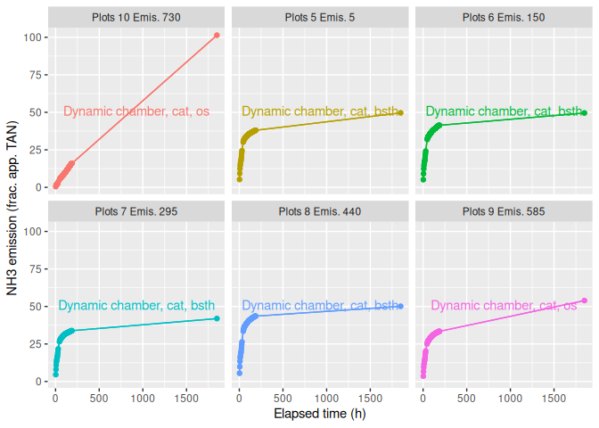<!-- -->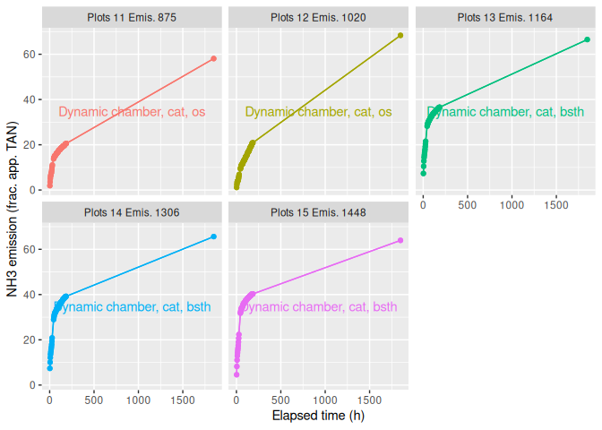<!-- -->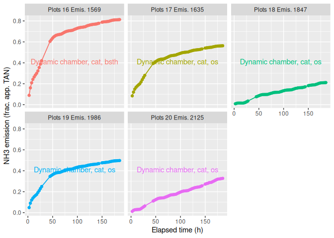<!-- -->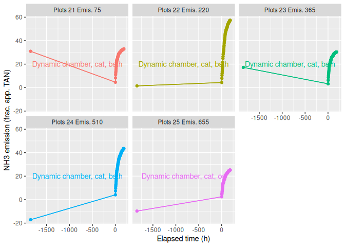<!-- -->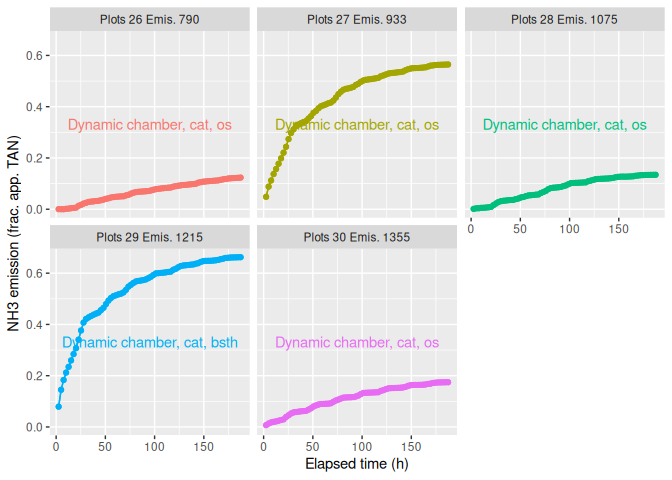<!-- -->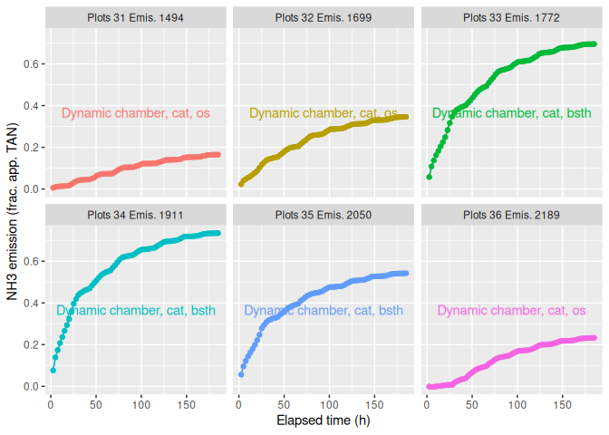<!-- -->

## Final cumulative emission

    ## `stat_bin()` using `bins = 30`. Pick better value `binwidth`.

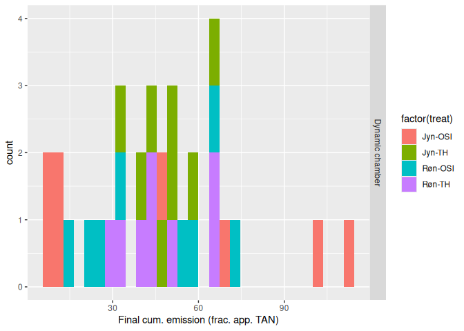<!-- -->

## Relative versus absolute emission

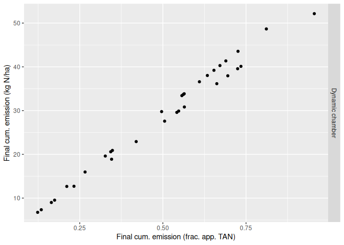<!-- -->

## Flux

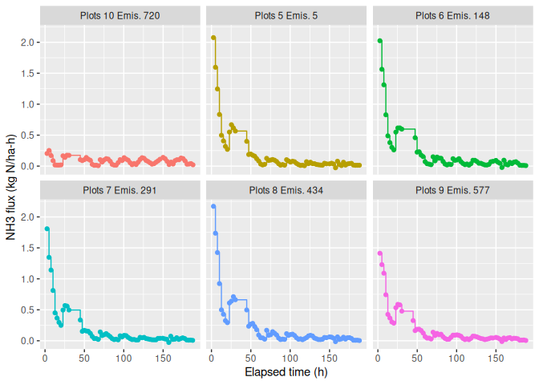<!-- -->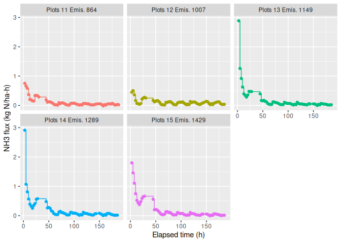<!-- -->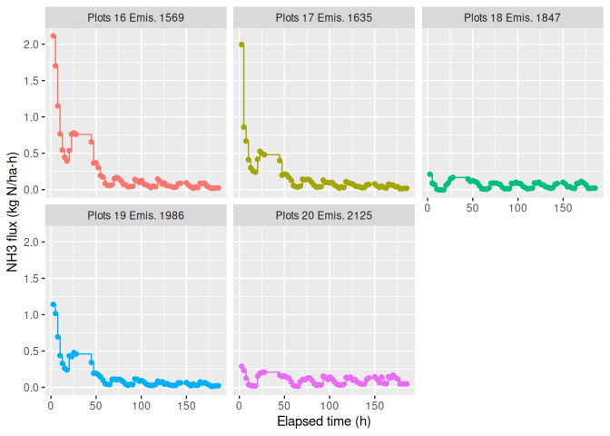<!-- -->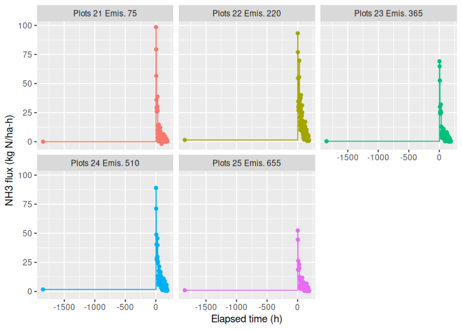<!-- -->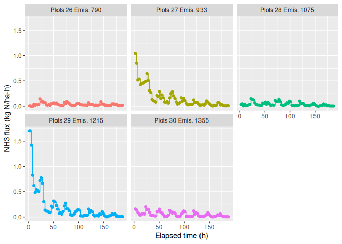<!-- -->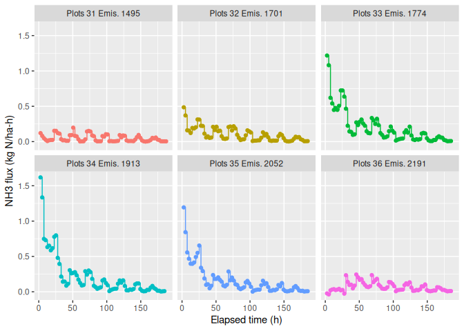<!-- -->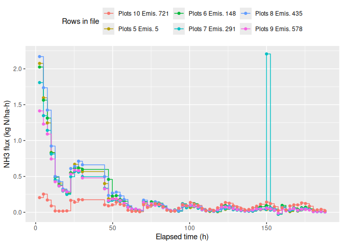<!-- -->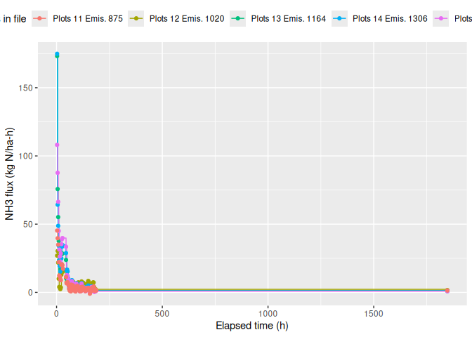<!-- -->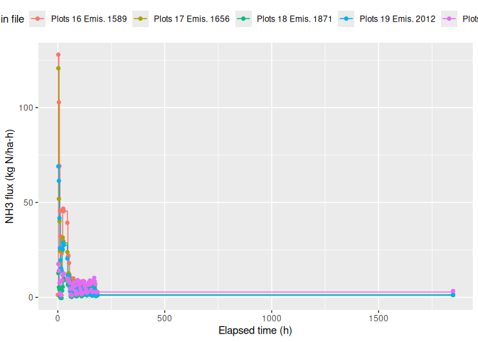<!-- -->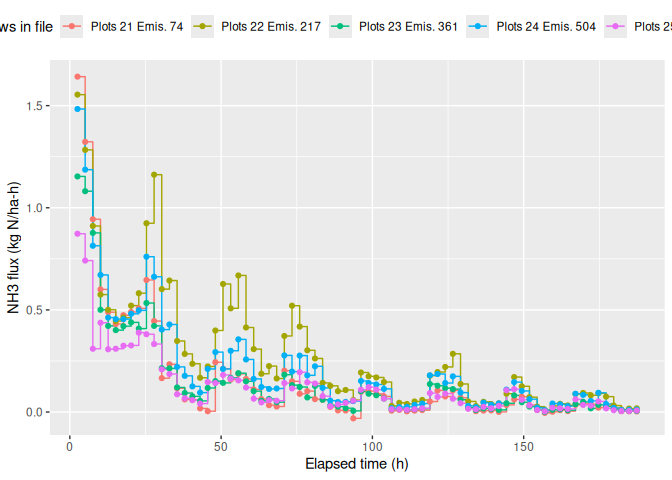<!-- -->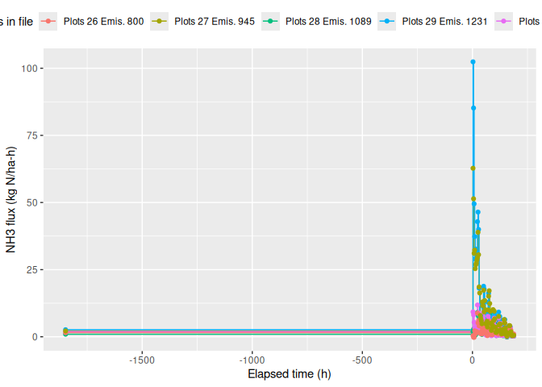<!-- -->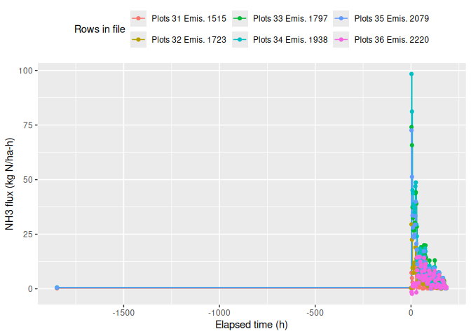<!-- --><!-- --><!-- --><!-- -->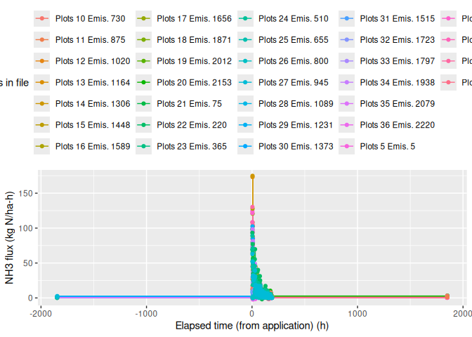<!-- --><!-- --><!-- -->

## Weather data

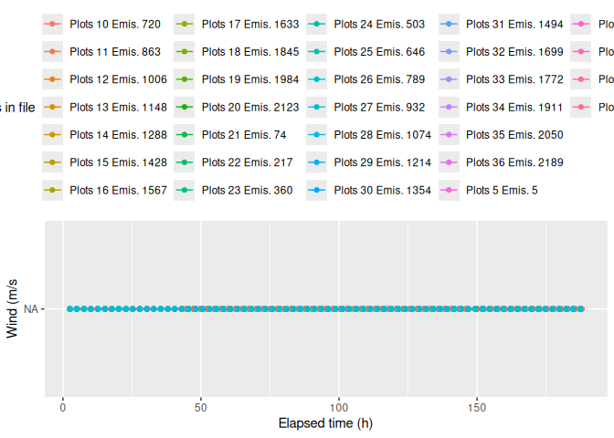<!-- -->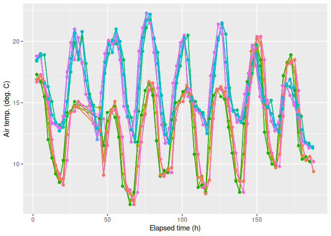<!-- -->

    ## Warning: Removed 1 row containing missing values or values outside the scale
    ## range (`geom_line()`).

    ## Warning: Removed 1 row containing missing values or values outside the scale range
    ## (`geom_point()`).

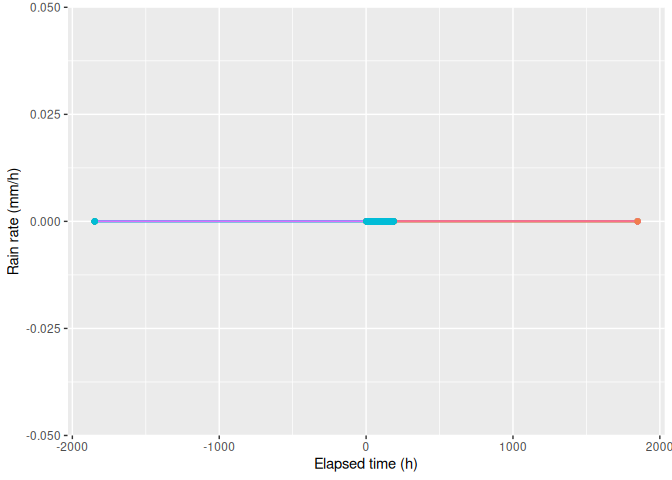<!-- -->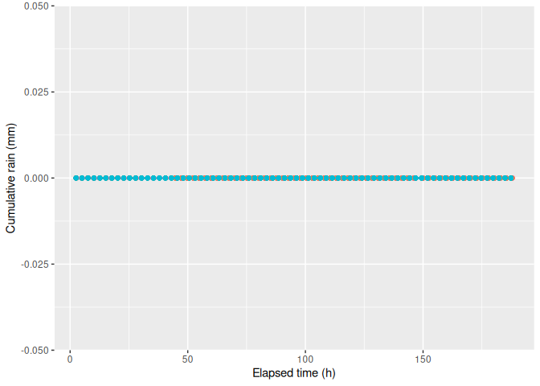<!-- -->

## Manure and application

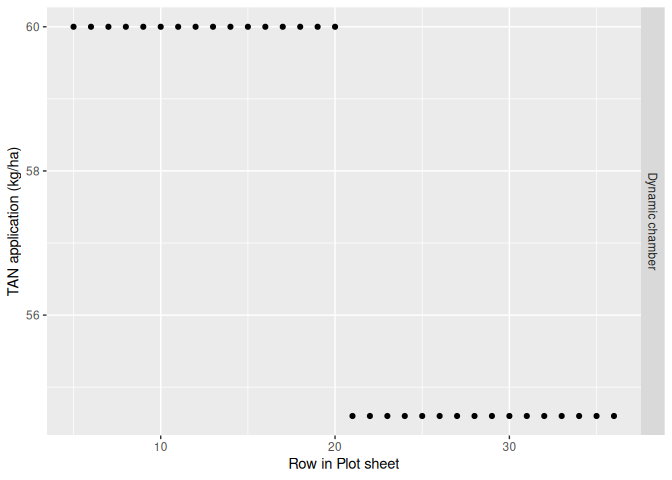<!-- -->

# 10. Summary

## Plot-level data

    ## 
    ##  32 rows and 210 columns
    ##  32 unique rows
    ##                       pub.id      proj     exper
    ## Class              character character character
    ## Minimum                 <NA>   N-Grass   Trial 1
    ## Maximum                 <NA>   N-Grass   Trial 2
    ## Mean                    <NA>      <NA>      <NA>
    ## Unique (excld. NA)         0         1         2
    ## Missing values            32         0         0
    ## Sorted                  <NA>      TRUE      TRUE
    ##                                                 
    ##                                                                                                                                                                                         cpmid
    ## Class                                                                                                                                                                               character
    ## Minimum             D:1.I:AU.Pr:N-Grass.F:../../data-submitted/04/AU/ALFAM2_template_8.3_NGrass1+2.xlsx.E:Trial 1.F:semi-field.P:1.T:Røn-TH.R:1.R2:.T:2025-05-13 10:00:00.M:Dynamic chamberNA
    ## Maximum            D:1.I:AU.Pr:N-Grass.F:../../data-submitted/04/AU/ALFAM2_template_8.3_NGrass1+2.xlsx.E:Trial 2.F:semi-field.P:8.T:Røn-OSI.R:2.R2:.T:2025-07-29 10:15:00.M:Dynamic chamberNA
    ## Mean                                                                                                                                                                                     <NA>
    ## Unique (excld. NA)                                                                                                                                                                         32
    ## Missing values                                                                                                                                                                              0
    ## Sorted                                                                                                                                                                                   TRUE
    ##                                                                                                                                                                                              
    ##                         field      plot       rep plot.area     lat    long
    ## Class               character character character   numeric numeric numeric
    ## Minimum            semi-field         1         1      0.38    56.5    9.58
    ## Maximum            semi-field         8         4      0.38    56.5    9.58
    ## Mean                     <NA>      <NA>      <NA>      0.38    56.5    9.58
    ## Unique (excld. NA)          1        17         4         1       1       1
    ## Missing values              0         0         0         0       0       0
    ## Sorted                   TRUE     FALSE     FALSE      TRUE    TRUE    TRUE
    ##                                                                            
    ##                      country      topo soil.samp.z    clay    silt    sand
    ## Class              character character   character integer integer integer
    ## Minimum                   DK      Flat         0-5       4       5      49
    ## Maximum                   DK      Flat         0-5      18      31      89
    ## Mean                    <NA>      <NA>        <NA>      11      18      69
    ## Unique (excld. NA)         1         1           1       2       2       2
    ## Missing values             0         0           0       0       0       0
    ## Sorted                  TRUE      TRUE        TRUE   FALSE   FALSE   FALSE
    ##                                                                           
    ##                         oc soil.type soil.water soil.water.v soil.moist soil.ph
    ## Class              logical   logical    numeric      logical  character numeric
    ## Minimum               <NA>      <NA>       0.01         <NA>        Dry     6.1
    ## Maximum               <NA>      <NA>       0.16         <NA>        Dry     6.6
    ## Mean                  <NA>      <NA>     0.0725         <NA>       <NA>    6.38
    ## Unique (excld. NA)       0         0          4            0          1       4
    ## Missing values          32        32          0           32          0       0
    ## Sorted                <NA>      <NA>      FALSE         <NA>       TRUE   FALSE
    ##                                                                                
    ##                    soil.dens  crop.res      till man.source man.source.det
    ## Class                numeric character character  character        logical
    ## Minimum                  1.3       Yes        No        cat           <NA>
    ## Maximum                  1.5       Yes        No        cat           <NA>
    ## Mean                     1.4      <NA>      <NA>       <NA>           <NA>
    ## Unique (excld. NA)         3         1         1          1              0
    ## Missing values             0         0         0          0             32
    ## Sorted                 FALSE      TRUE      TRUE       TRUE           <NA>
    ##                                                                           
    ##                    man.bed   man.con  man.trt1 man.trt2 man.trt3 man.stor
    ## Class              logical character character  logical  logical  logical
    ## Minimum               <NA>    slurry      None     <NA>     <NA>     <NA>
    ## Maximum               <NA>    slurry      None     <NA>     <NA>     <NA>
    ## Mean                  <NA>      <NA>      <NA>     <NA>     <NA>     <NA>
    ## Unique (excld. NA)       0         1         1        0        0        0
    ## Missing values          32         0         0       32       32       32
    ## Sorted                <NA>      TRUE      TRUE     <NA>     <NA>     <NA>
    ##                                                                          
    ##                     man.dm  man.vs man.tkn man.tan man.tic  man.ua man.vfa
    ## Class              numeric numeric numeric numeric logical logical logical
    ## Minimum               7.65     6.2    3.29    1.82    <NA>    <NA>    <NA>
    ## Maximum               9.28    7.15    3.37       2    <NA>    <NA>    <NA>
    ## Mean                  8.46    6.68    3.33    1.91    <NA>    <NA>    <NA>
    ## Unique (excld. NA)       2       2       2       2       0       0       0
    ## Missing values           0       0       0       0      32      32      32
    ## Sorted               FALSE   FALSE   FALSE   FALSE    <NA>    <NA>    <NA>
    ##                                                                           
    ##                     man.ph           app.start             app.end app.method
    ## Class              numeric     POSIXct, POSIXt     POSIXct, POSIXt  character
    ## Minimum               6.89 2025-05-13 10:00:00 2025-05-13 10:42:00       bsth
    ## Maximum               6.92 2025-07-29 10:15:00 2025-07-29 10:51:00         os
    ## Mean                   6.9 2025-06-20 22:07:30 2025-06-20 22:46:30       <NA>
    ## Unique (excld. NA)       2                   2                   2          2
    ## Missing values           0                   0                   0          0
    ## Sorted               FALSE                TRUE                TRUE      FALSE
    ##                                                                              
    ##                    app.rate app.rate.unit    incorp time.incorp man.area
    ## Class               integer     character character     numeric  logical
    ## Minimum                  30          t/ha      none        <NA>     <NA>
    ## Maximum                  30          t/ha      none        <NA>     <NA>
    ## Mean                     30          <NA>      <NA>        <NA>     <NA>
    ## Unique (excld. NA)        1             1         1           0        0
    ## Missing values            0             0         0          32       32
    ## Sorted                 TRUE          TRUE      TRUE        <NA>     <NA>
    ##                                                                         
    ##                    dist.inj furrow.z furrow.w      crop  crop.z crop.area
    ## Class               logical  logical  logical character numeric   numeric
    ## Minimum                <NA>     <NA>     <NA>     grass       7      <NA>
    ## Maximum                <NA>     <NA>     <NA>     grass       7      <NA>
    ## Mean                   <NA>     <NA>     <NA>      <NA>       7      <NA>
    ## Unique (excld. NA)        0        0        0         1       1         0
    ## Missing values           32       32       32         0       0        32
    ## Sorted                 <NA>     <NA>     <NA>      TRUE    TRUE      <NA>
    ##                                                                          
    ##                        lai notes.plot row.in.file.plot institute sub.period
    ## Class              logical  character          numeric character    numeric
    ## Minimum               <NA>          .                5        AU          4
    ## Maximum               <NA>          .               36        AU          4
    ## Mean                  <NA>       <NA>             20.5      <NA>          4
    ## Unique (excld. NA)       0          1               32         1          1
    ## Missing values          32         31                0         0          0
    ## Sorted                <NA>       TRUE            FALSE      TRUE       TRUE
    ##                                                                            
    ##                                                                             file
    ## Class                                                                  character
    ## Minimum            ../../data-submitted/04/AU/ALFAM2_template_8.3_NGrass1+2.xlsx
    ## Maximum            ../../data-submitted/04/AU/ALFAM2_template_8.3_NGrass1+2.xlsx
    ## Mean                                                                        <NA>
    ## Unique (excld. NA)                                                             1
    ## Missing values                                                                 0
    ## Sorted                                                                      TRUE
    ##                                                                                 
    ##                        treat       meas.tech meas.tech.det   app.start.orig
    ## Class              character       character       logical        character
    ## Minimum              Jyn-OSI Dynamic chamber          <NA> 13-05-2025 10:00
    ## Maximum               Røn-TH Dynamic chamber          <NA> 29-07-2025 10:15
    ## Mean                    <NA>            <NA>          <NA>             <NA>
    ## Unique (excld. NA)         4               1             0                2
    ## Missing values             0               0            32                0
    ## Sorted                 FALSE            TRUE          <NA>             TRUE
    ##                                                                            
    ##                        app.end.orig
    ## Class                     character
    ## Minimum            13-05-2025 10:42
    ## Maximum            29-07-2025 10:51
    ## Mean                           <NA>
    ## Unique (excld. NA)                2
    ## Missing values                    0
    ## Sorted                         TRUE
    ##                                    
    ##                                                                                                                                                                      cpid
    ## Class                                                                                                                                                           character
    ## Minimum             D:1.I:AU.Pr:N-Grass.F:../../data-submitted/04/AU/ALFAM2_template_8.3_NGrass1+2.xlsx.E:Trial 1.F:semi-field.P:1.T:Røn-TH.R:1.R2:.T:2025-05-13 10:00:00
    ## Maximum            D:1.I:AU.Pr:N-Grass.F:../../data-submitted/04/AU/ALFAM2_template_8.3_NGrass1+2.xlsx.E:Trial 2.F:semi-field.P:8.T:Røn-OSI.R:2.R2:.T:2025-07-29 10:15:00
    ## Mean                                                                                                                                                                 <NA>
    ## Unique (excld. NA)                                                                                                                                                     32
    ## Missing values                                                                                                                                                          0
    ## Sorted                                                                                                                                                               TRUE
    ##                                                                                                                                                                          
    ##                                             ceid flag.plot          submitter
    ## Class                                  character character          character
    ## Minimum            D:1.I:AU.Pr:N-Grass.E:Trial 1           Pedersen, Johanna 
    ## Maximum            D:1.I:AU.Pr:N-Grass.E:Trial 2           Pedersen, Johanna 
    ## Mean                                        <NA>      <NA>               <NA>
    ## Unique (excld. NA)                             2         1                  1
    ## Missing values                                 0         0                  0
    ## Sorted                                      TRUE      TRUE               TRUE
    ##                                                                              
    ##                    tan.app e.cum.1 e.cum.4 e.cum.6 e.cum.12 e.cum.24 e.cum.48
    ## Class              numeric numeric numeric numeric  numeric  numeric  numeric
    ## Minimum               54.6   -1.14   -6.93   -8.28     2.57     23.4      123
    ## Maximum                 60    1830     550     682     1010     1330     2240
    ## Mean                  57.3     290     262     354      518      758     1150
    ## Unique (excld. NA)       2      16      32      32       32       32       32
    ## Missing values           0      16       0       0        0        0        0
    ## Sorted               FALSE   FALSE   FALSE   FALSE    FALSE    FALSE    FALSE
    ##                                                                              
    ##                    e.cum.72 e.cum.96 e.cum.168 e.cum.final e.rel.1 e.rel.4
    ## Class               numeric  numeric   numeric     numeric numeric numeric
    ## Minimum                 180      239       378         405  -0.021  -0.127
    ## Maximum                2470     2660      3070        6760    30.5    9.16
    ## Mean                   1330     1460      1690        2680    5.11    4.53
    ## Unique (excld. NA)       32       32        32          32      16      32
    ## Missing values            0        0         0           0      16       0
    ## Sorted                FALSE    FALSE     FALSE       FALSE   FALSE   FALSE
    ##                                                                           
    ##                    e.rel.6 e.rel.12 e.rel.24 e.rel.48 e.rel.72 e.rel.96
    ## Class              numeric  numeric  numeric  numeric  numeric  numeric
    ## Minimum             -0.152    0.047    0.429     2.25     3.29     4.38
    ## Maximum               11.4     16.8     22.6     37.4     43.2     48.8
    ## Mean                  6.12     8.97     13.2       20     23.2     25.4
    ## Unique (excld. NA)      32       32       32       32       32       32
    ## Missing values           0        0        0        0        0        0
    ## Sorted               FALSE    FALSE    FALSE    FALSE    FALSE    FALSE
    ##                                                                        
    ##                    e.rel.168 e.rel.final  rain.1  rain.4  rain.6 rain.12
    ## Class                numeric     numeric numeric numeric numeric numeric
    ## Minimum                 6.92        7.41       0       0       0       0
    ## Maximum                 56.2         113       0       0       0       0
    ## Mean                    29.4        45.9       0       0       0       0
    ## Unique (excld. NA)        32          32       1       1       1       1
    ## Missing values             0           0      16       0       0       0
    ## Sorted                 FALSE       FALSE    TRUE    TRUE    TRUE    TRUE
    ##                                                                         
    ##                    rain.24 rain.48 rain.72 rain.96 rain.168 rain.final
    ## Class              numeric numeric numeric numeric  numeric    numeric
    ## Minimum                  0       0       0       0        0          0
    ## Maximum                  0       0       0       0        0          0
    ## Mean                     0       0       0       0        0          0
    ## Unique (excld. NA)       1       1       1       1        1          1
    ## Missing values           0       0       0       0        0          0
    ## Sorted                TRUE    TRUE    TRUE    TRUE     TRUE       TRUE
    ##                                                                       
    ##                    air.temp.1 air.temp.4 air.temp.6 air.temp.12 air.temp.24
    ## Class                 numeric    numeric    numeric     numeric     numeric
    ## Minimum                    10        9.9        9.8        9.67        9.63
    ## Maximum                  13.3       18.8       18.8        17.3        15.6
    ## Mean                       12       14.5       14.5          14        12.4
    ## Unique (excld. NA)          5         15         18          19          27
    ## Missing values             16          0          0           0           0
    ## Sorted                  FALSE      FALSE      FALSE       FALSE       FALSE
    ##                                                                            
    ##                    air.temp.48 air.temp.72 air.temp.96 air.temp.168 air.temp.mn
    ## Class                  numeric     numeric     numeric      numeric     numeric
    ## Minimum                   8.83         8.4        6.54        -33.2        9.77
    ## Maximum                   16.1        16.4        16.6         16.4        6200
    ## Mean                      12.6        12.1          12         10.1         343
    ## Unique (excld. NA)          31          32          32           32          31
    ## Missing values               0           0           0            0           0
    ## Sorted                   FALSE       FALSE       FALSE        FALSE       FALSE
    ##                                                                                
    ##                    soil.temp.1 soil.temp.4 soil.temp.6 soil.temp.12
    ## Class                  numeric     numeric     numeric      numeric
    ## Minimum                   <NA>        <NA>        <NA>         <NA>
    ## Maximum                   <NA>        <NA>        <NA>         <NA>
    ## Mean                      <NA>        <NA>        <NA>         <NA>
    ## Unique (excld. NA)           0           0           0            0
    ## Missing values              32          32          32           32
    ## Sorted                    <NA>        <NA>        <NA>         <NA>
    ##                                                                    
    ##                    soil.temp.24 soil.temp.48 soil.temp.72 soil.temp.96
    ## Class                   numeric      numeric      numeric      numeric
    ## Minimum                    <NA>         <NA>         <NA>         <NA>
    ## Maximum                    <NA>         <NA>         <NA>         <NA>
    ## Mean                       <NA>         <NA>         <NA>         <NA>
    ## Unique (excld. NA)            0            0            0            0
    ## Missing values               32           32           32           32
    ## Sorted                     <NA>         <NA>         <NA>         <NA>
    ##                                                                       
    ##                    soil.temp.168 soil.temp.mn soil.temp.surf.1 soil.temp.surf.4
    ## Class                    numeric      numeric          numeric          numeric
    ## Minimum                     <NA>         <NA>             <NA>             <NA>
    ## Maximum                     <NA>         <NA>             <NA>             <NA>
    ## Mean                        <NA>         <NA>             <NA>             <NA>
    ## Unique (excld. NA)             0            0                0                0
    ## Missing values                32           32               32               32
    ## Sorted                      <NA>         <NA>             <NA>             <NA>
    ##                                                                                
    ##                    soil.temp.surf.6 soil.temp.surf.12 soil.temp.surf.24
    ## Class                       numeric           numeric           numeric
    ## Minimum                        <NA>              <NA>              <NA>
    ## Maximum                        <NA>              <NA>              <NA>
    ## Mean                           <NA>              <NA>              <NA>
    ## Unique (excld. NA)                0                 0                 0
    ## Missing values                   32                32                32
    ## Sorted                         <NA>              <NA>              <NA>
    ##                                                                        
    ##                    soil.temp.surf.48 soil.temp.surf.72 soil.temp.surf.96
    ## Class                        numeric           numeric           numeric
    ## Minimum                         <NA>              <NA>              <NA>
    ## Maximum                         <NA>              <NA>              <NA>
    ## Mean                            <NA>              <NA>              <NA>
    ## Unique (excld. NA)                 0                 0                 0
    ## Missing values                    32                32                32
    ## Sorted                          <NA>              <NA>              <NA>
    ##                                                                         
    ##                    soil.temp.surf.168 soil.temp.surf.mn  wind.1  wind.4  wind.6
    ## Class                         numeric           numeric numeric numeric numeric
    ## Minimum                          <NA>              <NA>    <NA>    <NA>    <NA>
    ## Maximum                          <NA>              <NA>    <NA>    <NA>    <NA>
    ## Mean                             <NA>              <NA>    <NA>    <NA>    <NA>
    ## Unique (excld. NA)                  0                 0       0       0       0
    ## Missing values                     32                32      32      32      32
    ## Sorted                           <NA>              <NA>    <NA>    <NA>    <NA>
    ##                                                                                
    ##                    wind.12 wind.24 wind.48 wind.72 wind.96 wind.168 wind.mn
    ## Class              numeric numeric numeric numeric numeric  numeric numeric
    ## Minimum               <NA>    <NA>    <NA>    <NA>    <NA>     <NA>    <NA>
    ## Maximum               <NA>    <NA>    <NA>    <NA>    <NA>     <NA>    <NA>
    ## Mean                  <NA>    <NA>    <NA>    <NA>    <NA>     <NA>    <NA>
    ## Unique (excld. NA)       0       0       0       0       0        0       0
    ## Missing values          32      32      32      32      32       32      32
    ## Sorted                <NA>    <NA>    <NA>    <NA>    <NA>     <NA>    <NA>
    ##                                                                            
    ##                    wind.2m.1 wind.2m.4 wind.2m.6 wind.2m.12 wind.2m.24
    ## Class                numeric   numeric   numeric    numeric    numeric
    ## Minimum                 <NA>      <NA>      <NA>       <NA>       <NA>
    ## Maximum                 <NA>      <NA>      <NA>       <NA>       <NA>
    ## Mean                    <NA>      <NA>      <NA>       <NA>       <NA>
    ## Unique (excld. NA)         0         0         0          0          0
    ## Missing values            32        32        32         32         32
    ## Sorted                  <NA>      <NA>      <NA>       <NA>       <NA>
    ##                                                                       
    ##                    wind.2m.48 wind.2m.72 wind.2m.96 wind.2m.168 wind.2m.mn
    ## Class                 numeric    numeric    numeric     numeric    numeric
    ## Minimum                  <NA>       <NA>       <NA>        <NA>       <NA>
    ## Maximum                  <NA>       <NA>       <NA>        <NA>       <NA>
    ## Mean                     <NA>       <NA>       <NA>        <NA>       <NA>
    ## Unique (excld. NA)          0          0          0           0          0
    ## Missing values             32         32         32          32         32
    ## Sorted                   <NA>       <NA>       <NA>        <NA>       <NA>
    ##                                                                           
    ##                      rad.1   rad.4   rad.6  rad.12  rad.24  rad.48  rad.72
    ## Class              numeric numeric numeric numeric numeric numeric numeric
    ## Minimum               <NA>    <NA>    <NA>    <NA>    <NA>    <NA>    <NA>
    ## Maximum               <NA>    <NA>    <NA>    <NA>    <NA>    <NA>    <NA>
    ## Mean                  <NA>    <NA>    <NA>    <NA>    <NA>    <NA>    <NA>
    ## Unique (excld. NA)       0       0       0       0       0       0       0
    ## Missing values          32      32      32      32      32      32      32
    ## Sorted                <NA>    <NA>    <NA>    <NA>    <NA>    <NA>    <NA>
    ##                                                                           
    ##                     rad.96 rad.168  rad.mn rain.rate.1 rain.rate.4 rain.rate.6
    ## Class              numeric numeric numeric     numeric     numeric     numeric
    ## Minimum               <NA>    <NA>    <NA>           0           0           0
    ## Maximum               <NA>    <NA>    <NA>           0           0           0
    ## Mean                  <NA>    <NA>    <NA>           0           0           0
    ## Unique (excld. NA)       0       0       0           1           1           1
    ## Missing values          32      32      32          16           0           0
    ## Sorted                <NA>    <NA>    <NA>        TRUE        TRUE        TRUE
    ##                                                                               
    ##                    rain.rate.12 rain.rate.24 rain.rate.48 rain.rate.72
    ## Class                   numeric      numeric      numeric      numeric
    ## Minimum                       0            0            0            0
    ## Maximum                       0            0            0            0
    ## Mean                          0            0            0            0
    ## Unique (excld. NA)            1            1            1            1
    ## Missing values                0            0            0            0
    ## Sorted                     TRUE         TRUE         TRUE         TRUE
    ##                                                                       
    ##                    rain.rate.96 rain.rate.168 rain.rate.mn    rh.1    rh.4
    ## Class                   numeric       numeric      numeric numeric numeric
    ## Minimum                       0             0            0    <NA>    <NA>
    ## Maximum                       0             0            0    <NA>    <NA>
    ## Mean                          0             0            0    <NA>    <NA>
    ## Unique (excld. NA)            1             1            1       0       0
    ## Missing values                0             0            0      32      32
    ## Sorted                     TRUE          TRUE         TRUE    <NA>    <NA>
    ##                                                                           
    ##                       rh.6   rh.12   rh.24   rh.48   rh.72   rh.96  rh.168
    ## Class              numeric numeric numeric numeric numeric numeric numeric
    ## Minimum               <NA>    <NA>    <NA>    <NA>    <NA>    <NA>    <NA>
    ## Maximum               <NA>    <NA>    <NA>    <NA>    <NA>    <NA>    <NA>
    ## Mean                  <NA>    <NA>    <NA>    <NA>    <NA>    <NA>    <NA>
    ## Unique (excld. NA)       0       0       0       0       0       0       0
    ## Missing values          32      32      32      32      32      32      32
    ## Sorted                <NA>    <NA>    <NA>    <NA>    <NA>    <NA>    <NA>
    ##                                                                           
    ##                      rh.mn first.row.in.file.int last.row.in.file.int  n.ints
    ## Class              numeric               numeric              numeric integer
    ## Minimum               <NA>                     5                   74      67
    ## Maximum               <NA>                  2220                 2290      75
    ## Mean                  <NA>                  1120                 1190    71.5
    ## Unique (excld. NA)       0                    32                   32       5
    ## Missing values          32                     0                    0       0
    ## Sorted                <NA>                 FALSE                FALSE   FALSE
    ##                                                                              
    ##                        dt1  j.rel1  j.NH31  dt.min  dt.max  ct.min  ct.max
    ## Class              numeric numeric numeric numeric numeric numeric numeric
    ## Minimum              -2040 -0.0256    -1.4   -2040    2.53   -1850     185
    ## Maximum               2.53    2.91     175    2.52    1660    2.53    1850
    ## Mean                  -900   0.702    42.1    -901     781    -807     965
    ## Unique (excld. NA)       6      32      32       8       4       6       4
    ## Missing values           0       0       0       0       0       0       0
    ## Sorted               FALSE   FALSE   FALSE   FALSE   FALSE   FALSE   FALSE
    ##                                                                           
    ##                              t.start.p             t.end.p air.temp.z
    ## Class                  POSIXct, POSIXt     POSIXct, POSIXt    integer
    ## Minimum            2025-05-13 10:52:00 2025-05-21 03:28:00          2
    ## Maximum            2025-08-06 07:52:00 2025-08-06 05:20:00          2
    ## Mean               2025-06-24 21:23:03 2025-06-28 17:16:30          2
    ## Unique (excld. NA)                  32                  32          1
    ## Missing values                       0                   0          0
    ## Sorted                           FALSE               FALSE       TRUE
    ##                                                                      
    ##                    soil.temp.z  wind.z wind.loc far.loc  pub.info soil.type2
    ## Class                  logical logical  logical logical character    logical
    ## Minimum                   <NA>    <NA>     <NA>    <NA>         .       <NA>
    ## Maximum                   <NA>    <NA>     <NA>    <NA>         .       <NA>
    ## Mean                      <NA>    <NA>     <NA>    <NA>      <NA>       <NA>
    ## Unique (excld. NA)           0       0        0       0         1          0
    ## Missing values              32      32       32      32         0         32
    ## Sorted                    <NA>    <NA>     <NA>    <NA>      TRUE       <NA>
    ##                                                                             
    ##                     exper2    rep2    acid  meas.tech.orig meas.tech2 crop.orig
    ## Class              logical logical logical       character  character character
    ## Minimum               <NA>    <NA>   FALSE Dynamic chamber    chamber     Grass
    ## Maximum               <NA>    <NA>   FALSE Dynamic chamber    chamber     Grass
    ## Mean                  <NA>    <NA>  0 TRUE            <NA>       <NA>      <NA>
    ## Unique (excld. NA)       0       0       1               1          1         1
    ## Missing values          32      32       0               0          0         0
    ## Sorted                <NA>    <NA>    TRUE            TRUE       TRUE      TRUE
    ##                                                                                
    ##                                 app.method.orig incorp.orig man.source.orig
    ## Class                                 character   character       character
    ## Minimum            Band spread or trailing hose        None          Cattle
    ## Maximum                     Open slot injection        None          Cattle
    ## Mean                                       <NA>        <NA>            <NA>
    ## Unique (excld. NA)                            2           1               1
    ## Missing values                                0           0               0
    ## Sorted                                    FALSE        TRUE            TRUE
    ##                                                                            
    ##                    date.start
    ## Class                    Date
    ## Minimum            2025-05-13
    ## Maximum            2025-08-06
    ## Mean                     <NA>
    ## Unique (excld. NA)          4
    ## Missing values              0
    ## Sorted                  FALSE
    ## 

## Interval-level emission data

    ## 
    ##  2289 rows and 139 columns
    ##  2289 unique rows
    ##                                                                                                                                                                                         cpmid
    ## Class                                                                                                                                                                               character
    ## Minimum             D:1.I:AU.Pr:N-Grass.F:../../data-submitted/04/AU/ALFAM2_template_8.3_NGrass1+2.xlsx.E:Trial 1.F:semi-field.P:1.T:Røn-TH.R:1.R2:.T:2025-05-13 10:00:00.M:Dynamic chamberNA
    ## Maximum            D:1.I:AU.Pr:N-Grass.F:../../data-submitted/04/AU/ALFAM2_template_8.3_NGrass1+2.xlsx.E:Trial 2.F:semi-field.P:8.T:Røn-OSI.R:2.R2:.T:2025-07-29 10:15:00.M:Dynamic chamberNA
    ## Mean                                                                                                                                                                                     <NA>
    ## Unique (excld. NA)                                                                                                                                                                         32
    ## Missing values                                                                                                                                                                              0
    ## Sorted                                                                                                                                                                                   TRUE
    ##                                                                                                                                                                                              
    ##                       pub.id      proj     exper      field      plot       rep
    ## Class              character character character  character character character
    ## Minimum                 <NA>   N-Grass   Trial 1 semi-field         1         1
    ## Maximum                 <NA>   N-Grass   Trial 2 semi-field         8         4
    ## Mean                    <NA>      <NA>      <NA>       <NA>      <NA>      <NA>
    ## Unique (excld. NA)         0         1         2          1        17         4
    ## Missing values          2289         0         0          0         0         0
    ## Sorted                  <NA>      TRUE      TRUE       TRUE     FALSE     FALSE
    ##                                                                                
    ##                        treat       meas.tech meas.tech.det plot.area     lat
    ## Class              character       character       logical   numeric numeric
    ## Minimum              Jyn-OSI Dynamic chamber          <NA>      0.38    56.5
    ## Maximum               Røn-TH Dynamic chamber          <NA>      0.38    56.5
    ## Mean                    <NA>            <NA>          <NA>      0.38    56.5
    ## Unique (excld. NA)         4               1             0         1       1
    ## Missing values             0               0          2289         0       0
    ## Sorted                 FALSE            TRUE          <NA>      TRUE    TRUE
    ##                                                                             
    ##                       long   country      topo soil.samp.z    clay    silt
    ## Class              numeric character character   character integer integer
    ## Minimum               9.58        DK      Flat         0-5       4       5
    ## Maximum               9.58        DK      Flat         0-5      18      31
    ## Mean                  9.58      <NA>      <NA>        <NA>      11      18
    ## Unique (excld. NA)       1         1         1           1       2       2
    ## Missing values           0         0         0           0       0       0
    ## Sorted                TRUE      TRUE      TRUE        TRUE   FALSE   FALSE
    ##                                                                           
    ##                       sand      oc soil.type soil.water soil.water.v soil.moist
    ## Class              integer logical   logical    numeric      logical  character
    ## Minimum                 49    <NA>      <NA>       0.01         <NA>        Dry
    ## Maximum                 89    <NA>      <NA>       0.16         <NA>        Dry
    ## Mean                    69    <NA>      <NA>     0.0737         <NA>       <NA>
    ## Unique (excld. NA)       2       0         0          4            0          1
    ## Missing values           0    2289      2289          0         2289          0
    ## Sorted               FALSE    <NA>      <NA>      FALSE         <NA>       TRUE
    ##                                                                                
    ##                    soil.ph soil.dens  crop.res      till man.source
    ## Class              numeric   numeric character character  character
    ## Minimum                6.1       1.3       Yes        No        cat
    ## Maximum                6.6       1.5       Yes        No        cat
    ## Mean                  6.38       1.4      <NA>      <NA>       <NA>
    ## Unique (excld. NA)       4         3         1         1          1
    ## Missing values           0         0         0         0          0
    ## Sorted               FALSE     FALSE      TRUE      TRUE       TRUE
    ##                                                                    
    ##                    man.source.det man.bed   man.con  man.trt1 man.trt2 man.trt3
    ## Class                     logical logical character character  logical  logical
    ## Minimum                      <NA>    <NA>    slurry      None     <NA>     <NA>
    ## Maximum                      <NA>    <NA>    slurry      None     <NA>     <NA>
    ## Mean                         <NA>    <NA>      <NA>      <NA>     <NA>     <NA>
    ## Unique (excld. NA)              0       0         1         1        0        0
    ## Missing values               2289    2289         0         0     2289     2289
    ## Sorted                       <NA>    <NA>      TRUE      TRUE     <NA>     <NA>
    ##                                                                                
    ##                    man.stor  man.dm  man.vs man.tkn man.tan man.tic  man.ua
    ## Class               logical numeric numeric numeric numeric logical logical
    ## Minimum                <NA>    7.65     6.2    3.29    1.82    <NA>    <NA>
    ## Maximum                <NA>    9.28    7.15    3.37       2    <NA>    <NA>
    ## Mean                   <NA>    8.43    6.65    3.33    1.91    <NA>    <NA>
    ## Unique (excld. NA)        0       2       2       2       2       0       0
    ## Missing values         2289       0       0       0       0    2289    2289
    ## Sorted                 <NA>   FALSE   FALSE   FALSE   FALSE    <NA>    <NA>
    ##                                                                            
    ##                    man.vfa  man.ph           app.start             app.end
    ## Class              logical numeric     POSIXct, POSIXt     POSIXct, POSIXt
    ## Minimum               <NA>    6.89 2025-05-13 10:00:00 2025-05-13 10:42:00
    ## Maximum               <NA>    6.92 2025-07-29 10:15:00 2025-07-29 10:51:00
    ## Mean                  <NA>     6.9 2025-06-22 14:05:37 2025-06-22 14:44:29
    ## Unique (excld. NA)       0       2                   2                   2
    ## Missing values        2289       0                   0                   0
    ## Sorted                <NA>   FALSE                TRUE                TRUE
    ##                                                                           
    ##                    app.method app.rate app.rate.unit    incorp time.incorp
    ## Class               character  integer     character character     numeric
    ## Minimum                  bsth       30          t/ha      none        <NA>
    ## Maximum                    os       30          t/ha      none        <NA>
    ## Mean                     <NA>       30          <NA>      <NA>        <NA>
    ## Unique (excld. NA)          2        1             1         1           0
    ## Missing values              0        0             0         0        2289
    ## Sorted                  FALSE     TRUE          TRUE      TRUE        <NA>
    ##                                                                           
    ##                    man.area dist.inj furrow.z furrow.w      crop  crop.z
    ## Class               logical  logical  logical  logical character numeric
    ## Minimum                <NA>     <NA>     <NA>     <NA>     grass       7
    ## Maximum                <NA>     <NA>     <NA>     <NA>     grass       7
    ## Mean                   <NA>     <NA>     <NA>     <NA>      <NA>       7
    ## Unique (excld. NA)        0        0        0        0         1       1
    ## Missing values         2289     2289     2289     2289         0       0
    ## Sorted                 <NA>     <NA>     <NA>     <NA>      TRUE    TRUE
    ##                                                                         
    ##                    crop.area     lai notes.plot row.in.file.plot institute
    ## Class                numeric logical  character          numeric character
    ## Minimum                 <NA>    <NA>          .                5        AU
    ## Maximum                 <NA>    <NA>          .               36        AU
    ## Mean                    <NA>    <NA>       <NA>             20.8      <NA>
    ## Unique (excld. NA)         0       0          1               32         1
    ## Missing values          2289    2289       2219                0         0
    ## Sorted                  <NA>    <NA>       TRUE            FALSE      TRUE
    ##                                                                           
    ##                    sub.period
    ## Class                 numeric
    ## Minimum                     4
    ## Maximum                     4
    ## Mean                        4
    ## Unique (excld. NA)          1
    ## Missing values              0
    ## Sorted                   TRUE
    ##                              
    ##                                                                             file
    ## Class                                                                  character
    ## Minimum            ../../data-submitted/04/AU/ALFAM2_template_8.3_NGrass1+2.xlsx
    ## Maximum            ../../data-submitted/04/AU/ALFAM2_template_8.3_NGrass1+2.xlsx
    ## Mean                                                                        <NA>
    ## Unique (excld. NA)                                                             1
    ## Missing values                                                                 0
    ## Sorted                                                                      TRUE
    ##                                                                                 
    ##                      app.start.orig     app.end.orig
    ## Class                     character        character
    ## Minimum            13-05-2025 10:00 13-05-2025 10:42
    ## Maximum            29-07-2025 10:15 29-07-2025 10:51
    ## Mean                           <NA>             <NA>
    ## Unique (excld. NA)                2                2
    ## Missing values                    0                0
    ## Sorted                         TRUE             TRUE
    ##                                                     
    ##                                                                                                                                                                      cpid
    ## Class                                                                                                                                                           character
    ## Minimum             D:1.I:AU.Pr:N-Grass.F:../../data-submitted/04/AU/ALFAM2_template_8.3_NGrass1+2.xlsx.E:Trial 1.F:semi-field.P:1.T:Røn-TH.R:1.R2:.T:2025-05-13 10:00:00
    ## Maximum            D:1.I:AU.Pr:N-Grass.F:../../data-submitted/04/AU/ALFAM2_template_8.3_NGrass1+2.xlsx.E:Trial 2.F:semi-field.P:8.T:Røn-OSI.R:2.R2:.T:2025-07-29 10:15:00
    ## Mean                                                                                                                                                                 <NA>
    ## Unique (excld. NA)                                                                                                                                                     32
    ## Missing values                                                                                                                                                          0
    ## Sorted                                                                                                                                                               TRUE
    ##                                                                                                                                                                          
    ##                                             ceid flag.plot          submitter
    ## Class                                  character character          character
    ## Minimum            D:1.I:AU.Pr:N-Grass.E:Trial 1           Pedersen, Johanna 
    ## Maximum            D:1.I:AU.Pr:N-Grass.E:Trial 2           Pedersen, Johanna 
    ## Mean                                        <NA>      <NA>               <NA>
    ## Unique (excld. NA)                             2         1                  1
    ## Missing values                                 0         0                  0
    ## Sorted                                      TRUE      TRUE               TRUE
    ##                                                                              
    ##                    tan.app interval             t.start               t.end
    ## Class              numeric  numeric     POSIXct, POSIXt     POSIXct, POSIXt
    ## Minimum               54.6        1 2025-05-13 10:52:00 2025-05-13 11:00:00
    ## Maximum                 60       75 2025-08-06 07:52:00 2025-08-06 07:52:00
    ## Mean                  57.2     36.3 2025-06-26 15:02:35 2025-06-26 15:55:56
    ## Unique (excld. NA)       2       75                2289                2288
    ## Missing values           0        0                   0                   0
    ## Sorted               FALSE    FALSE               FALSE               FALSE
    ##                                                                            
    ##                         dt   bg.dl  bg.val   bg.unit        j.type   j.NH3
    ## Class              numeric logical numeric character     character numeric
    ## Minimum              -2040    <NA>   0.011       ppm emission rate    -2.3
    ## Maximum               1660    <NA>   0.125       ppm emission rate     175
    ## Mean                 0.889    <NA>  0.0352      <NA>          <NA>    8.71
    ## Unique (excld. NA)      16       0     145         1             1    2289
    ## Missing values           0    2289       0         0             0       0
    ## Sorted               FALSE    <NA>   FALSE      TRUE          TRUE   FALSE
    ##                                                                           
    ##                    j.NH3.unit pH.surf air.temp air.temp.z soil.temp soil.temp.z
    ## Class               character logical  numeric    integer   logical     logical
    ## Minimum            kg N/ha-hr    <NA>      6.7          2      <NA>        <NA>
    ## Maximum            kg N/ha-hr    <NA>     22.3          2      <NA>        <NA>
    ## Mean                     <NA>    <NA>     14.6          2      <NA>        <NA>
    ## Unique (excld. NA)          1       0      131          1         0           0
    ## Missing values              0    2289        0          0      2289        2289
    ## Sorted                   TRUE    <NA>    FALSE       TRUE      <NA>        <NA>
    ##                                                                                
    ##                    soil.temp.surf     rad    wind  wind.z     MOL   ustar
    ## Class                     logical logical logical logical logical logical
    ## Minimum                      <NA>    <NA>    <NA>    <NA>    <NA>    <NA>
    ## Maximum                      <NA>    <NA>    <NA>    <NA>    <NA>    <NA>
    ## Mean                         <NA>    <NA>    <NA>    <NA>    <NA>    <NA>
    ## Unique (excld. NA)              0       0       0       0       0       0
    ## Missing values               2289    2289    2289    2289    2289    2289
    ## Sorted                       <NA>    <NA>    <NA>    <NA>    <NA>    <NA>
    ##                                                                          
    ##                         rl air.pres air.pres.unit    rain      rh wind.loc
    ## Class              logical  logical       logical numeric logical  logical
    ## Minimum               <NA>     <NA>          <NA>       0    <NA>     <NA>
    ## Maximum               <NA>     <NA>          <NA>       0    <NA>     <NA>
    ## Mean                  <NA>     <NA>          <NA>       0    <NA>     <NA>
    ## Unique (excld. NA)       0        0             0       1       0        0
    ## Missing values        2289     2289          2289       0    2289     2289
    ## Sorted                <NA>     <NA>          <NA>    TRUE    <NA>     <NA>
    ##                                                                           
    ##                    far.loc chamber.vol chamber.flow chamber.AER notes.int
    ## Class              logical     numeric      numeric     numeric character
    ## Minimum               <NA>        0.15        0.032       0.213         .
    ## Maximum               <NA>        0.15        0.032       0.213         .
    ## Mean                  <NA>        0.15        0.032       0.213      <NA>
    ## Unique (excld. NA)       0           1            1           1         1
    ## Missing values        2289           0            0           0      2288
    ## Sorted                <NA>        TRUE         TRUE        TRUE      TRUE
    ##                                                                          
    ##                    row.in.file.int     t.start.orig       t.end.orig j.NH3.orig
    ## Class                      numeric        character        character    numeric
    ## Minimum                          5 01-08-2025 00:04 01-08-2025 00:04       -2.3
    ## Maximum                       2290 31-07-2025 23:56 31-07-2025 23:56        175
    ## Mean                          1150             <NA>             <NA>       8.71
    ## Unique (excld. NA)            2289             2289             2289       2289
    ## Missing values                   0                0                0          0
    ## Sorted                       FALSE            FALSE            FALSE      FALSE
    ##                                                                                
    ##                    j.NH3.conv.fact j.NH3.unit.orig dt.calc dt.diff      ct
    ## Class                      numeric       character numeric numeric numeric
    ## Minimum                          1      kg N/ha-hr   -2040       0   -1850
    ## Maximum                          1      kg N/ha-hr    1660       0    1850
    ## Mean                             1            <NA>   0.889       0    95.8
    ## Unique (excld. NA)               1               1      16       1     159
    ## Missing values                   0               0       0       0       0
    ## Sorted                        TRUE            TRUE   FALSE    TRUE   FALSE
    ##                                                                           
    ##                         mt     cta     bta  flag.int rain.rate rain.cum wind.2m
    ## Class              numeric numeric numeric character   numeric  numeric numeric
    ## Minimum               -832   -1850   0.783                   0        0    <NA>
    ## Maximum               1020    1850     190                   0        0    <NA>
    ## Mean                  95.4    97.8    96.9      <NA>         0        0    <NA>
    ## Unique (excld. NA)     178    2288    2289         1         1        1       0
    ## Missing values           0       0       0         0         1        0    2289
    ## Sorted               FALSE   FALSE   FALSE      TRUE      TRUE     TRUE    <NA>
    ##                                                                                
    ##                      e.int   e.cum   e.rel   j.rel  pub.info soil.type2  exper2
    ## Class              numeric numeric numeric numeric character    logical logical
    ## Minimum              -5340   -3370   -61.7 -0.0422         .       <NA>    <NA>
    ## Maximum               5580    6760     113    2.91         .       <NA>    <NA>
    ## Mean                  23.4    1330    23.2   0.152      <NA>       <NA>    <NA>
    ## Unique (excld. NA)    2289    2288    2288    2289         1          0       0
    ## Missing values           0       0       0       0         0       2289    2289
    ## Sorted               FALSE   FALSE   FALSE   FALSE      TRUE       <NA>    <NA>
    ##                                                                                
    ##                       rep2    acid  meas.tech.orig meas.tech2 crop.orig
    ## Class              logical logical       character  character character
    ## Minimum               <NA>   FALSE Dynamic chamber    chamber     Grass
    ## Maximum               <NA>   FALSE Dynamic chamber    chamber     Grass
    ## Mean                  <NA>  0 TRUE            <NA>       <NA>      <NA>
    ## Unique (excld. NA)       0       1               1          1         1
    ## Missing values        2289       0               0          0         0
    ## Sorted                <NA>    TRUE            TRUE       TRUE      TRUE
    ##                                                                        
    ##                                 app.method.orig incorp.orig man.source.orig
    ## Class                                 character   character       character
    ## Minimum            Band spread or trailing hose        None          Cattle
    ## Maximum                     Open slot injection        None          Cattle
    ## Mean                                       <NA>        <NA>            <NA>
    ## Unique (excld. NA)                            2           1               1
    ## Missing values                                0           0               0
    ## Sorted                                    FALSE        TRUE            TRUE
    ##                                                                            
    ##                    date.start first.row.int row.plot         first.rows
    ## Class                    Date       numeric  numeric             factor
    ## Minimum            2025-05-13             5        5 Plots 10 Emis. 730
    ## Maximum            2025-05-13          2220       36  Plots 9 Emis. 585
    ## Mean                     <NA>          1110     20.8 Plots 26 Emis. 800
    ## Unique (excld. NA)          1            32       32                 32
    ## Missing values              0             0        0                  0
    ## Sorted                   TRUE         FALSE    FALSE              FALSE
    ##                                                                        
    ##                    ggplotgroup
    ## Class                   factor
    ## Minimum            (4.97,10.2]
    ## Maximum              (30.8,36]
    ## Mean               (20.5,25.7]
    ## Unique (excld. NA)           6
    ## Missing values               0
    ## Sorted                   FALSE
    ## 
